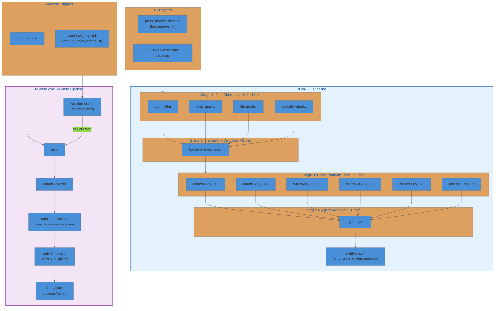

# nWave Framework CI/CD Pipelines

Two separate workflows: CI runs automatically on every push/PR, Release runs only when Mike triggers it.

## Architecture



## Workflow Files

| File | Trigger | Purpose | Permissions |
|------|---------|---------|-------------|
| `ci.yml` | push/PR on master, develop | Quality gates + tests | `contents: read` |
| `release.yml` | `workflow_dispatch` or tag push | Version bump, build, release, cross-repo publish, PyPI upload | `contents: write` |

The `tags-ignore: ['v*']` on CI prevents duplicate runs when the release workflow pushes a version tag.

## CI Pipeline (`ci.yml`)

Runs automatically on every push and pull request. Read-only permissions.

### Jobs

**Stage 1: Fast Checks** (parallel, ~1 min)

Four parallel jobs on `ubuntu-latest`. Gate for everything downstream.

<details>
<summary><strong>commitlint</strong></summary>

Validates conventional commits using `gitlint`.

- **PR**: validates the full PR commit range (`base..head`)
- **Push**: validates the pushed commit range (`before..after`)
- **Force push / new branch**: falls back to validating HEAD only, with a warning annotation
</details>

<details>
<summary><strong>code-quality</strong></summary>

Runs Ruff on `src/`, `scripts/`, `tools/`, `tests/`.

- `ruff check` with `--exit-non-zero-on-fix` (lint)
- `ruff format --check --diff` (format)
</details>

<details>
<summary><strong>file-quality</strong></summary>

- Trailing whitespace detection (excludes `dist/`, `.git/`)
- End-of-file newline enforcement (first 200 tracked files)
- YAML syntax validation via PyYAML (all `*.yaml` / `*.yml`)
- JSON syntax validation (all `*.json`, excludes `node_modules`)
</details>

<details>
<summary><strong>security-checks</strong></summary>

- Merge conflict markers (`<<<<<<<`, `=======`, `>>>>>>>`)
- Private key detection (`-----BEGIN ... PRIVATE KEY-----`)
- Shell script prevention via `scripts/hooks/prevent_shell_scripts.py`
</details>

**Stage 2: Framework Validation** (needs Stage 1)

| Check | Tool | What it validates |
|-------|------|-------------------|
| Catalog schema | Inline Python | `nWave/framework-catalog.yaml` has required fields; version is valid semver |
| Version consistency | Inline Python | `pyproject.toml` version matches `framework-catalog.yaml` version |
| Docs version | `scripts/hooks/validate_docs.py` | Documentation version consistency |
| Docs freshness | `scripts/hooks/check_documentation_freshness.py` | Documentation is not stale |
| File conflicts | `scripts/hooks/detect_conflicts.py` | No conflicting file definitions |

**Stage 3: Cross-Platform Tests** (needs Stage 2, ~10 min)

Matrix strategy (`fail-fast: false`):

| | ubuntu-latest | windows-latest | macos-latest |
|---|:---:|:---:|:---:|
| **Python 3.11** | test | test | test |
| **Python 3.12** | test | test | test |

Each of the 6 jobs runs pytest with coverage (XML + HTML), JUnit XML, Allure results, and HTML test reports. Artifacts uploaded with 14-day retention.

**Stage 4: Agent Validation** (needs Stage 3)

Runs `scripts/framework/sync_agent_names.py --verify` to confirm agent names are synchronized across the framework catalog and source files.

**Slack Notification** (always, needs all above)

Full RED/GREEN state machine. See [Slack Notification State Machine](#slack-notification-state-machine).

## Release Pipeline (`release.yml`)

Manual workflow. Triggered from the Actions UI or by pushing a `v*` tag.

### Inputs (workflow_dispatch)

| Input | Type | Default | Description |
|-------|------|---------|-------------|
| `version_override` | string | empty | Force a specific version (leave empty for auto-bump) |
| `dry_run` | boolean | `false` | Preview what would happen without pushing or publishing |

### Jobs

**version-bump** (dispatch only)

Uses [python-semantic-release](https://python-semantic-release.readthedocs.io/) to calculate the next version from conventional commits, update `pyproject.toml` + `framework-catalog.yaml`, commit, tag, and push.

- If `version_override` is set: forces that specific version
- If `dry_run` is true: runs with `--print` to show what would happen, no changes pushed

**build** (after version-bump or on tag push)

| Step | Description |
|------|-------------|
| Extract version | From version-bump output or tag ref |
| Version consistency | Compares version against `framework-catalog.yaml` |
| Release packages | `scripts/framework/create_release_packages.py --version X.Y.Z` |
| Checksums | SHA256 for all release files |
| Artifact upload | `release-packages`, 90-day retention |

**github-release** (after build)

Creates a GitHub Release with a changelog auto-generated from conventional commits between the previous and current tag.

Changelog sections (included when commits of that type exist):

| Section | Commit pattern |
|---------|---------------|
| Breaking Changes | `feat!:`, `fix!:`, or `BREAKING CHANGE:` in body |
| Features | `feat:` or `feat(scope):` |
| Bug Fixes | `fix:` or `fix(scope):` |
| Other Changes | All other conventional types and non-conventional commits |

**publish-to-nwave** (after github-release)

Syncs the repository to `nwave-ai/nwave` using rsync with an exclude list for local/dev artifacts (`pyproject.toml`, `setup.py`, `Pipfile*`, etc. are excluded; nwave-ai maintains its own). Updates nwave-ai's version from `[tool.nwave] public_version` in nwave-dev's `pyproject.toml`. Commits as "nWave Release Train". Skipped on dry runs.

**publish-to-pypi** (after publish-to-nwave)

Checks out `nwave-ai/nwave` (which now has the synced content), builds a wheel + sdist using hatchling, and uploads to TestPyPI via twine. Skipped on dry runs.

Once validated on TestPyPI, this will switch to production PyPI. The package is published as `nwave-ai`:

```
pipx install nwave-ai && nwave-ai install
```

**notify-slack** (always, needs all above)

Simple success/failure notification. No state machine needed since releases are manual and infrequent.

- Success: "Released vX.Y.Z" with links to release, run, and PyPI
- Failure: "Release Pipeline Failed" with failed jobs list

## Release Process

Releases are now **manual**, triggered from the GitHub Actions UI.

```
1. Mike clicks: Actions > Release Pipeline > Run workflow
2. version-bump: PSR analyzes conventional commits, bumps version, creates tag
3. build: Creates release packages, validates version consistency
4. github-release: Publishes GitHub Release with changelog and artifacts
5. publish-to-nwave: Syncs files to nwave-ai/nwave, updates nwave-ai version
6. publish-to-pypi: Builds wheel from nwave-ai/nwave, uploads to TestPyPI
7. notify-slack: Sends release notification to Slack
```

Version bump rules (from conventional commits):

| Commit pattern | Version bump |
|---------------|-------------|
| `fix:` | Patch (`1.2.3` to `1.2.4`) |
| `feat:` | Minor (`1.2.3` to `1.3.0`) |
| `feat!:`, `fix!:`, or `BREAKING CHANGE:` footer | Major (`1.2.3` to `2.0.0`) |
| `docs:`, `style:`, `ci:`, `chore:`, `test:`, `refactor:` only | No release |

## Slack Notification State Machine

The CI workflow's `notify-slack` job implements a two-state machine to avoid notification fatigue.

```
                     +---------+
          failure    |         |  failure
       +----------->|   RED   |<---------+
       |            |         |          |
       |            +----+----+          |
       |                 |               |
       |             success             |
       |                 |               |
       |            +----v----+          |
       |            |         |          |
       |            |  GREEN  |          |
       |            |         |          |
       |            +----+----+          |
       |                 |               |
       |             success             |
       |                 |               |
       |            +----v----+          |
       |            |         |          |
       +------------+ SILENT  +----------+
                    |         |  failure
                    +---------+
```

| Transition | Notification | Content |
|------------|-------------|---------|
| any --> failure | RED | Failed job names, branch, author (@mention), commit, timestamp, action buttons |
| failure --> success | GREEN | Recovery confirmation, time-since-failure, previously-failed jobs now passing |
| success --> success | Silent | No notification sent |

State persistence: `ci-pipeline-state-{ref}-{run_id}` cache key.

## Caching Strategy

| Cache | Key Pattern | Scope |
|-------|-------------|-------|
| Pip dependencies | `{os}-pip-{CACHE_VERSION}-{python}-{Pipfile.lock hash}` | Per OS + Python version, with progressive fallback |
| CI pipeline state | `ci-pipeline-state-{ref}-{run_id}` | Per branch ref, Slack state machine |

Bump `CACHE_VERSION` (currently `v3`) to force a full cache invalidation across all jobs.

## Environment Variables

| Variable | Value | Used in |
|----------|-------|---------|
| `PYTHON_DEFAULT` | `3.12` | Both workflows, non-matrix jobs |
| `CACHE_VERSION` | `v3` | CI, pip cache key prefix |
| `PYTHONIOENCODING` | `utf-8` | CI, force UTF-8 stdout/stderr |
| `PYTHONUTF8` | `1` | CI, Python UTF-8 mode |

## Required Secrets

| Secret | CI | Release | Purpose |
|--------|:---:|:---:|---------|
| `SLACK_WEBHOOK_URL` | Yes | Yes | Slack notifications |
| `GH_TOKEN` | No | Yes | Push version tag (PAT with `contents: write`, needed because default `GITHUB_TOKEN` cannot trigger subsequent workflow runs) |
| `GITHUB_TOKEN` | Auto | Auto | GitHub Release creation |
| `RELEASETRAIN` | No | Yes | PAT with push access to `nwave-ai/nwave` |
| `TEST_PYPI_API_TOKEN` | No | Yes | Upload `nwave-ai` wheel to TestPyPI (will switch to `PYPI_TOKEN` for production) |

## Permissions

| Workflow | Permissions | Rationale |
|----------|------------|-----------|
| CI | `contents: read`, `pull-requests: read` | Read-only; no writes needed |
| Release | `contents: write` | Creates tags and GitHub Releases |
