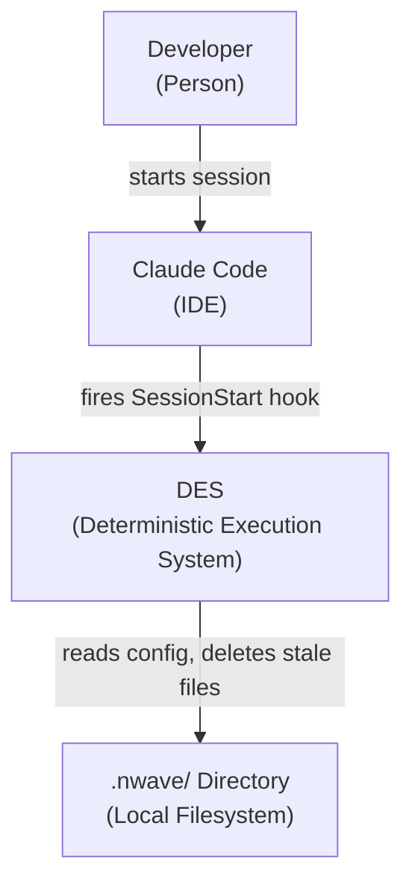
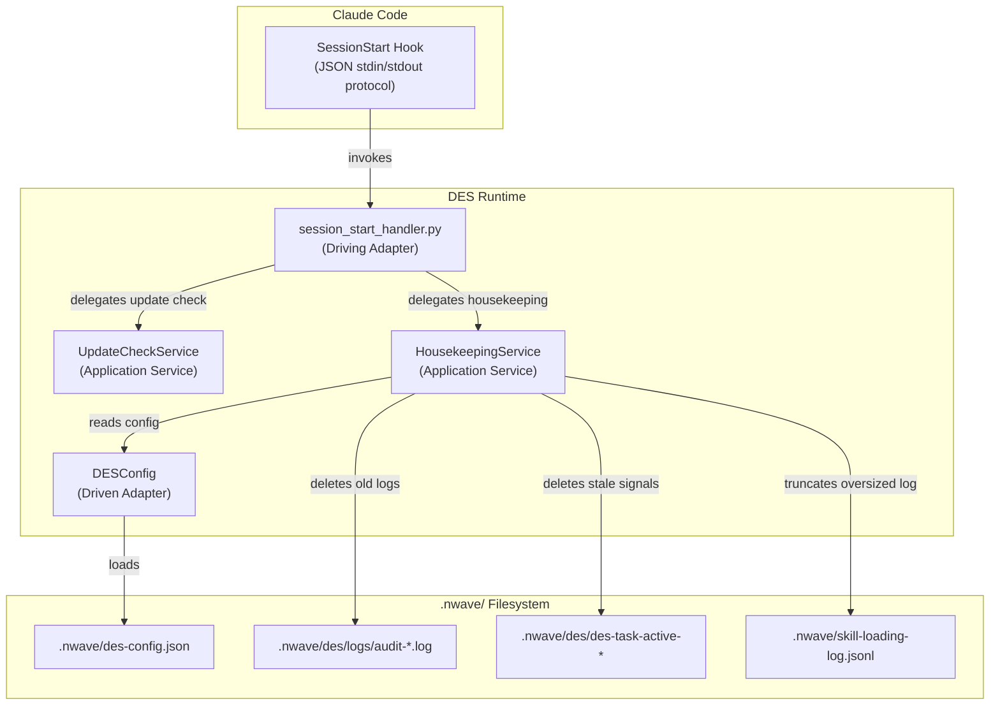
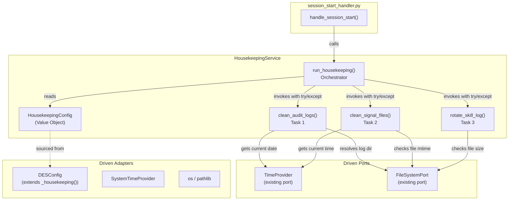

# Architecture Design: DES Housekeeping

Feature: Automatic cleanup of `.nwave/` operational files at SessionStart hook.

Traces to: `docs/requirements/des-housekeeping/user-stories.md` (US-HK-01 through US-HK-04)

---

## System Context

DES Housekeeping runs within the existing DES hook lifecycle. It is triggered by the SessionStart hook (Claude Code fires this on session open/resume) and operates exclusively on local `.nwave/` files.

No external systems. No network calls. No user interaction.



## C4 Container Diagram (L2)



## C4 Component Diagram (L3) -- HousekeepingService

The service has 5+ logical responsibilities (config reading, 3 cleanup tasks, orchestration with fail-isolation), warranting a component diagram.



---

## Architecture Decisions

### Decision 1: HousekeepingService as a Single Application Service

**Context**: Three cleanup tasks (audit log retention, signal file cleanup, skill log rotation) must run at session start with independent fail-isolation.

**Decision**: A single `HousekeepingService` in `src/des/application/` orchestrates all three tasks. Each task is a method on the service, not a separate class. The orchestrator wraps each task call in its own `try/except`.

**Rationale**:
- Follows the `UpdateCheckService` pattern (single service, single responsibility boundary)
- Three tasks share the same fail-isolation pattern and configuration source
- Separate classes would be over-engineering for methods that are 10-20 lines of filesystem operations each
- Testable: each task method can be tested independently; orchestration tested via the public `run_housekeeping()` method

**Alternatives rejected**:
1. *Inline in session_start_handler.py* -- violates separation of concerns; handler is a driving adapter, not business logic. Would mix protocol (stdin/stdout) with domain operations.
2. *Three separate service classes* -- each task is ~15 lines of filesystem logic. Three classes, three files, three constructors for trivial operations. Violates simplest-solution principle.
3. *Strategy pattern with task registry* -- extensible but zero evidence of future tasks. YAGNI. Can refactor if a 4th+ task appears.

### Decision 2: No New Driven Port for Housekeeping

**Context**: Housekeeping performs filesystem operations (list, stat, delete, read/write). An existing `FileSystemPort` exists but covers only JSON read/write and existence checks -- not glob, stat, or unlink.

**Decision**: The `HousekeepingService` receives a `TimeProvider` (existing port, for current time) and uses direct filesystem operations (`pathlib.Path`, `os.path.getmtime`, `os.path.getsize`) for file manipulation. No new port abstraction.

**Rationale**:
- The existing `FileSystemPort` does not cover the operations needed (glob, unlink, getmtime, getsize). Extending it would bloat its interface.
- Creating a dedicated `HousekeepingFileSystemPort` would add an ABC, an adapter, and a test double for operations that are already trivially mockable via `tmp_path` (pytest) or `unittest.mock.patch`.
- `TimeProvider` is the only port needed for testability: it controls "now" so date comparisons are deterministic. Filesystem operations are tested with real temp directories (fast, reliable, no mocking needed).
- This follows the same pattern as `UpdateCheckService` which injects URLs and config but does not abstract `urllib` behind a port.

**Alternatives rejected**:
1. *New HousekeepingFileSystemPort* -- adds 3 files (port, adapter, test double) for operations already testable with `tmp_path`. Overhead exceeds benefit.
2. *Extend existing FileSystemPort* -- would add unrelated methods to an interface used by other services. Violates interface segregation.

### Decision 3: DESConfig Extension with `_housekeeping()` Sub-Config

**Context**: Housekeeping needs configuration (retention days, staleness hours, size threshold, enabled flag) from `des-config.json`.

**Decision**: Extend `DESConfig` with a `_housekeeping()` private method (returns dict from `housekeeping` key) and public properties for each setting: `housekeeping_enabled`, `housekeeping_audit_retention_days`, `housekeeping_signal_staleness_hours`, `housekeeping_skill_log_max_bytes`.

**Rationale**:
- Follows the established `_rigor()` / `_update_check()` pattern exactly
- Properties provide typed access with defaults (no raw dict access by consumers)
- `DESConfig` is already the single configuration adapter for all DES settings

**No alternatives considered** -- this is the established pattern. Deviating would introduce inconsistency.

### Decision 4: Integration Point -- session_start_handler.py Modification

**Context**: Housekeeping must run at session start. The existing `session_start_handler.py` currently handles only update checks.

**Decision**: Add a `_run_housekeeping()` call within `handle_session_start()`, before the update check. Housekeeping is wrapped in its own `try/except` (independent of the update check's try/except). The DESConfig instance is shared.

**Rationale**:
- Housekeeping is fast (~50ms), local-only, and has no output -- it should run first so stale state is cleaned before any other operations
- Sharing the `DESConfig` instance avoids double-loading the config file
- Independent try/except means housekeeping failure cannot affect update check (and vice versa)

**Alternatives rejected**:
1. *Separate hook handler* -- Claude Code hooks are registered per event type (one handler per SessionStart). Adding a second handler would require changes to the hook adapter dispatch logic. Unnecessary complexity.
2. *Housekeeping after update check* -- functionally equivalent, but cleaning stale state first is more logical (clean environment before doing work).

### Decision 5: HousekeepingConfig Value Object

**Context**: The housekeeping service needs configuration values (retention days, staleness hours, etc.) but should not depend directly on `DESConfig` (an adapter).

**Decision**: Define a `HousekeepingConfig` value object (dataclass) that holds all housekeeping settings with defaults. The `session_start_handler` reads from `DESConfig` and constructs `HousekeepingConfig` to pass to the service.

**Rationale**:
- Decouples the application service from the config adapter (dependency inversion)
- The service receives a simple, typed value object -- easily constructed in tests without DESConfig
- Follows the pattern where driving adapters (handlers) wire dependencies for application services

**Alternatives rejected**:
1. *Pass DESConfig directly to service* -- couples application layer to adapter layer. Violates hexagonal architecture direction. Tests would need DESConfig instances or mocks.
2. *Pass individual parameters* -- 5 parameters (enabled, retention_days, staleness_hours, max_bytes, paths) is too many for a method signature. A config object is cleaner.

---

## Component Boundaries

### New Components

| Component | Location | Responsibility |
|-----------|----------|---------------|
| `HousekeepingService` | `src/des/application/housekeeping_service.py` | Orchestrate 3 cleanup tasks with fail-isolation |
| `HousekeepingConfig` | `src/des/application/housekeeping_service.py` | Value object holding housekeeping settings with defaults |

### Modified Components

| Component | Location | Change |
|-----------|----------|--------|
| `DESConfig` | `src/des/adapters/driven/config/des_config.py` | Add `_housekeeping()` + 4 public properties |
| `session_start_handler` | `src/des/adapters/drivers/hooks/session_start_handler.py` | Add housekeeping call before update check |

### Reused Components (No Changes)

| Component | Location | Usage |
|-----------|----------|-------|
| `AuditLogPathResolver` | `src/des/domain/audit_log_path_resolver.py` | Resolve audit log directory |
| `TimeProvider` | `src/des/ports/driven_ports/time_provider_port.py` | Current time for date comparisons |
| `SystemTimeProvider` | (existing adapter) | Production time provider |

---

## Technology Stack

All existing -- no new dependencies.

| Technology | Version | License | Rationale |
|-----------|---------|---------|-----------|
| Python | >=3.10 | PSF | Already required |
| pathlib | stdlib | PSF | File operations |
| os | stdlib | PSF | getmtime, getsize |
| datetime | stdlib | PSF | Date parsing, comparison |
| dataclasses | stdlib | PSF | HousekeepingConfig value object |

---

## Integration Patterns

### SessionStart Hook Flow (Updated)

```
Claude Code SessionStart
  |
  v
claude_code_hook_adapter.py (dispatch)
  |
  v
session_start_handler.py:handle_session_start()
  |
  +-- [try/except] _run_housekeeping(des_config)
  |     |
  |     +-- Build HousekeepingConfig from DESConfig
  |     +-- HousekeepingService.run_housekeeping(config)
  |           |
  |           +-- [try/except] clean_audit_logs(...)
  |           +-- [try/except] clean_signal_files(...)
  |           +-- [try/except] rotate_skill_log(...)
  |
  +-- [try/except] Update check (existing, unchanged)
  |
  v
exit 0 (always)
```

### Fail-Open Architecture

Three levels of fail-isolation:

1. **Task level**: Each cleanup task wrapped in `try/except` within `HousekeepingService.run_housekeeping()`. One task failure does not affect other tasks.
2. **Service level**: The entire `_run_housekeeping()` call wrapped in `try/except` in `session_start_handler.py`. Service-level failure does not affect update check.
3. **Handler level**: The existing `try/except` in `handle_session_start()` catches everything. Returns 0 always.

This is triple-nested fail-open: even if the service constructor throws, the session continues.

### Configuration Contract

```json
{
  "housekeeping": {
    "enabled": true,
    "audit_retention_days": 7,
    "signal_staleness_hours": 4,
    "skill_log_max_bytes": 1048576
  }
}
```

All fields optional. Entire `housekeeping` key optional. Defaults applied per-field.

---

## Quality Attribute Strategies

### Fault Tolerance (Priority 1)

- Triple-nested try/except (task > service > handler)
- Every code path exits 0
- No directory creation (if `.nwave/` is absent, housekeeping is a no-op)
- Individual file failures (PermissionError, etc.) are skipped per-file within each task

### Testability (Priority 2)

- `HousekeepingConfig` value object: trivially constructed in tests without DESConfig
- `TimeProvider` port: inject fixed time for deterministic date comparisons
- Real filesystem via `tmp_path`: no mocking needed for file operations
- Each task testable independently via service methods
- Orchestration testable by asserting fail-isolation behavior

### Maintainability (Priority 3)

- Single service file with clear task separation
- Follows established DESConfig extension pattern
- Minimal modification to existing handler (add one function call)
- Reuses `AuditLogPathResolver` for log directory resolution

### Performance (Priority 4)

- Budget: <500ms total for all tasks
- Audit logs: `iterdir()` + filename parse + `unlink()` -- O(n) where n = number of log files
- Signal files: `glob("des-task-active*")` + `getmtime()` + `unlink()` -- O(n) where n = signal files (typically 0-3)
- Skill log: `getsize()` + conditional tail-read + rewrite -- O(1) for size check, O(k) for truncation where k = 1000 lines
- All operations are local filesystem, no I/O waits

---

## Test Strategy

### Unit Tests (`tests/des/unit/`)

| Target | Location | What to Test |
|--------|----------|-------------|
| `HousekeepingService` orchestration | `tests/des/unit/application/test_housekeeping_service.py` | Fail-isolation (one task fails, others run); disabled config skips all; missing .nwave is no-op |
| Audit log retention | Same file or split | Date parsing from filename; retention cutoff; today's log never deleted; permission error skipped |
| Signal file cleanup | Same file or split | Mtime-based staleness; recent files preserved; multiple patterns (des-task-active-*, deliver-session.json) |
| Skill log rotation | Same file or split | Size threshold gate; truncation to last N lines; missing file no-op |
| `DESConfig` extension | `tests/des/unit/adapters/driven/config/test_des_config.py` | New properties return defaults; custom values parsed; partial config handled |

### Integration Tests (`tests/des/integration/`)

| Target | What to Test |
|--------|-------------|
| `session_start_handler` with housekeeping | Housekeeping runs alongside update check; failure isolation between them |

### Acceptance Tests (`tests/des/acceptance/`)

| Target | What to Test |
|--------|-------------|
| Full SessionStart flow | BDD scenarios from `docs/requirements/des-housekeeping/acceptance-criteria.md` |

---

## Roadmap (Implementation Order)

Recommended Outside-In TDD build order, aligned with DoR recommendation.

### Step 1: DESConfig Extension + HousekeepingConfig Value Object

**Description**: Extend DESConfig with `_housekeeping()` sub-config and 4 properties. Define HousekeepingConfig dataclass with defaults.

**AC**:
- DESConfig returns default values when housekeeping config absent
- DESConfig reads custom values from `housekeeping` key
- HousekeepingConfig constructible with defaults (no args)

**Architectural Constraints**:
- Follow `_rigor()` / `_update_check()` pattern exactly

### Step 2: HousekeepingService Orchestration Shell (US-HK-04)

**Description**: Create HousekeepingService with `run_housekeeping()` that calls 3 stub tasks with per-task fail-isolation.

**AC**:
- Service callable with HousekeepingConfig
- Disabled config skips all operations
- One task exception does not prevent other tasks from running
- Missing `.nwave/` directory does not cause errors
- No console output produced

**Architectural Constraints**:
- Each task in independent try/except
- Service in `src/des/application/housekeeping_service.py`

### Step 3: Audit Log Retention Task (US-HK-01)

**Description**: Implement audit log retention based on filename date parsing with configurable retention period.

**AC**:
- Audit logs older than retention period removed
- Today's log preserved regardless of retention setting
- Missing log directory is no-op
- Individual file deletion failures skipped

**Architectural Constraints**:
- Reuse `AuditLogPathResolver` for log directory
- Parse date from filename (`audit-YYYY-MM-DD.log`), not mtime

### Step 4: Orphaned Signal File Cleanup Task (US-HK-02)

**Description**: Remove stale signal files based on file modification time with configurable staleness threshold.

**AC**:
- Signal files older than staleness threshold removed
- Recent signal files preserved (concurrent session safety)
- `deliver-session.json` subject to same staleness check
- Missing `.nwave/des/` directory is no-op

**Architectural Constraints**:
- Use mtime (`os.path.getmtime`) for staleness
- Glob pattern: `des-task-active*` (catches namespaced + legacy)

### Step 5: Skill Tracking Log Rotation Task (US-HK-03)

**Description**: Truncate oversized skill tracking log to last ~1000 lines when exceeding size threshold.

**AC**:
- Log exceeding threshold truncated to most recent ~1000 lines
- Log below threshold not modified
- Missing log file is no-op
- Truncation failure silently skipped

**Architectural Constraints**:
- Size check as first gate (skip if under threshold)
- JSONL format: each line independent, tail-safe

### Step 6: SessionStart Handler Integration (US-HK-04 integration)

**Description**: Wire housekeeping into session_start_handler.py with independent fail-isolation from update check.

**AC**:
- Housekeeping runs at session start alongside update check
- Housekeeping failure does not affect update check
- Update check failure does not affect housekeeping
- Session exit code is always 0

**Architectural Constraints**:
- Housekeeping runs before update check
- Share DESConfig instance between housekeeping and update check
- Independent try/except at handler level

---

## File Inventory

### New Files (2)

| File | Type |
|------|------|
| `src/des/application/housekeeping_service.py` | Production |
| `tests/des/unit/application/test_housekeeping_service.py` | Test |

### Modified Files (2)

| File | Type |
|------|------|
| `src/des/adapters/driven/config/des_config.py` | Production |
| `src/des/adapters/drivers/hooks/session_start_handler.py` | Production |

### Modified Test Files (1)

| File | Type |
|------|------|
| `tests/des/unit/adapters/driven/config/test_des_config.py` | Test |

**Step ratio**: 6 steps / 3 production files = 2.0 (within 2.5 limit)

---

## Rejected Simple Alternatives

### Alternative 1: Cron/systemd timer outside DES

- **What**: External cleanup script triggered by OS scheduler
- **Expected Impact**: 100% of the problem
- **Why Insufficient**: nWave runs across Windows/macOS/Linux. OS-level schedulers differ per platform. DES already has a reliable trigger point (SessionStart). Adding external scheduling doubles operational complexity for zero benefit.

### Alternative 2: Inline cleanup in session_start_handler.py (no service)

- **What**: Add 40 lines of cleanup code directly in the handler
- **Expected Impact**: 100% of the problem
- **Why Insufficient**: Violates hexagonal architecture (business logic in adapter layer). Untestable without stdin/stdout mocking. Mixes protocol concerns with domain operations. Contradicts every other handler in the codebase which delegates to services.
