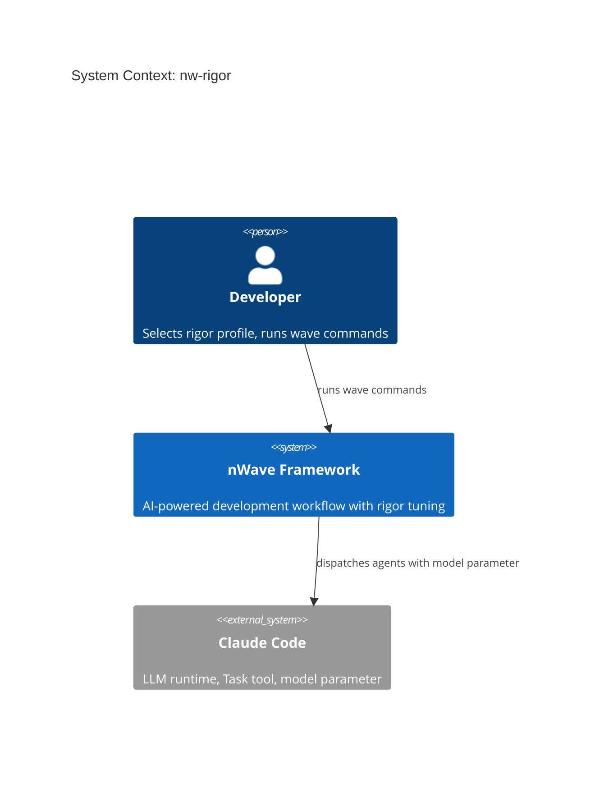
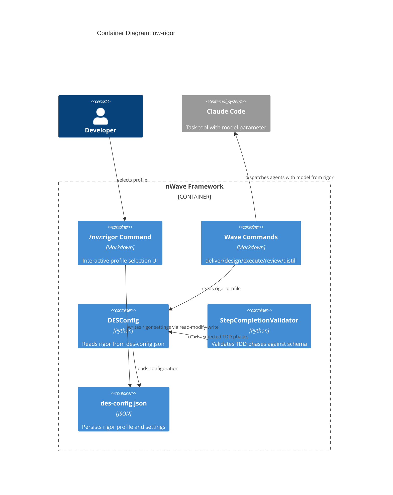

# Architecture Design: nw-rigor

## System Context

nw-rigor adds a quality-vs-token-consumption tuning system to nWave. Users select a rigor profile (lean/standard/thorough/exhaustive/inherit) via `/nw:rigor`. The profile persists in `.nwave/des-config.json` under the `rigor` key. All wave commands read this config at invocation time and adjust agent model, review behavior, TDD depth, and mutation testing gating.

## Capabilities

| ID | Capability | Description |
|----|-----------|-------------|
| C1 | Interactive profile selection | `/nw:rigor` command presents comparison table, lets user pick profile |
| C2 | Config persistence | Read-modify-write to `.nwave/des-config.json`, corruption recovery |
| C3 | Wave command integration | deliver/design/execute/review/distill read rigor and adjust behavior |
| C4 | TDD phase enforcement | DES validates against profile-specific phase set (lean = 2 phases) |

## C4 System Context (L1)



## C4 Container (L2)



## Component Architecture

### Layer 1: Command Layer (Markdown -- no Python)

**`/nw:rigor` command** (`nWave/tasks/nw/rigor.md`)
- New slash command file
- Presents interactive comparison table of all 5 profiles
- On user selection: reads `.nwave/des-config.json`, merges rigor block, writes back
- Pure markdown instructions for the orchestrating Claude instance
- Handles: profile display, detail drill-down, confirmation, persistence

### Layer 2: Wave Command Integration (Markdown modifications)

Modified commands read rigor config and pass `model` parameter to Task tool:

| Command File | Rigor Integration |
|-------------|-------------------|
| `deliver.md` | Agent model, reviewer model, TDD phase set, review skip, mutation skip, refactor skip |
| `execute.md` | Agent model, TDD phase set in DES template |
| `design.md` | Agent model |
| `review.md` | Reviewer model, double-review toggle |
| `distill.md` | Agent model |

Integration pattern (same for all commands):
1. Read `.nwave/des-config.json` at command start
2. Extract `rigor` block (default to standard if missing)
3. Map profile settings to Task tool parameters
4. Pass `model` parameter in Task invocation

### Layer 3: DES Runtime (Python -- minimal changes)

**DESConfig adapter** (`src/des/adapters/driven/config/des_config.py`)
- Add `rigor_profile` property returning the profile name (default: "standard")
- Add `rigor_settings` property returning full rigor dict with standard defaults
- Add `rigor_tdd_phases` property returning the TDD phase tuple for current profile
- No env var override (per constraint)
- Read-only: DESConfig never writes config

**StepCompletionValidator** (`src/des/domain/step_completion_validator.py`)
- Currently validates against `TDDSchema.tdd_phases` (hardcoded 5-phase set)
- Must accept a configurable phase set from rigor profile
- When lean profile active: only RED_UNIT and GREEN are mandatory
- Missing phases outside the rigor set are not flagged as abandoned

### Layer 4: Config Schema

```json
{
  "audit_logging_enabled": true,
  "skill_tracking": "disabled",
  "rigor": {
    "profile": "standard",
    "agent_model": "sonnet",
    "reviewer_model": "haiku",
    "tdd_phases": ["PREPARE", "RED_ACCEPTANCE", "RED_UNIT", "GREEN", "COMMIT"],
    "review_enabled": true,
    "double_review": false,
    "mutation_enabled": false,
    "refactor_pass": true
  }
}
```

When `rigor` key is absent, all consumers default to standard behavior.

## Component Boundaries

| Component | Responsibility | Boundary |
|-----------|---------------|----------|
| `rigor.md` | Interactive UI, config write | Owns user interaction + persistence |
| `deliver.md` | Orchestration with rigor-aware dispatch | Reads rigor, adjusts all 9 phases |
| `execute.md` | Single step dispatch with rigor model | Reads rigor, passes model + phases |
| `DESConfig` | Config access with rigor defaults | Read-only, provides typed properties |
| `StepCompletionValidator` | Phase validation against rigor phases | Accepts phase set, validates events |

## Integration Strategy

### Wave commands reading rigor (Markdown-level)

All wave commands add a **Rigor Configuration** section near the top:

```
## Rigor Configuration (read at invocation)

1. Read .nwave/des-config.json
2. Extract rigor block (if absent, use standard defaults)
3. Apply settings to Task invocations in this command:
   - model parameter from agent_model / reviewer_model
   - TDD phase set from tdd_phases
   - Skip/include phases based on review_enabled, mutation_enabled, refactor_pass
```

This is instruction-level integration. The orchestrating Claude instance (main session) reads the command file, follows the instructions, reads the config, and applies the settings.

### DES enforcement (Python-level)

The DES hook system validates step completion. Currently `StepCompletionValidator` uses `TDDSchema.tdd_phases` (always 5 phases). With rigor:

1. `DESConfig.rigor_tdd_phases` returns the expected phase tuple
2. The hook adapter passes this to the validator instead of the schema default
3. For lean: only `RED_UNIT` and `GREEN` are expected -- missing PREPARE/RED_ACCEPTANCE/COMMIT is not an error

The change point is where `StepCompletionValidator` is instantiated with a `TDDSchema`. Instead of always using the full schema, the caller can override `tdd_phases` with the rigor-specific set.

### Model parameter flow

```
/nw:deliver reads config -> rigor.agent_model = "haiku"
  -> Task(subagent_type="nw-software-crafter", model="haiku", ...)

/nw:review reads config -> rigor.reviewer_model = "sonnet"
  -> Task(subagent_type="nw-software-crafter-reviewer", model="sonnet", ...)
```

The `model` parameter is a native Task tool feature. Values: haiku, sonnet, opus, or omitted (inherit).

## Technology Stack

| Technology | Purpose | License | Rationale |
|-----------|---------|---------|-----------|
| Python 3.10+ | DESConfig changes | PSF | Existing stack |
| JSON | Config storage | N/A | Existing format |
| Markdown | Command files | N/A | Existing format |
| mypy strict | Type checking | MIT | Existing requirement |

No new dependencies. No new technologies. This is configuration plumbing within the existing stack.

## Quality Attribute Strategies

| Attribute | Strategy |
|-----------|----------|
| Maintainability | Profile mappings defined once in rigor.md, DESConfig provides typed access |
| Reliability | Missing rigor key defaults to standard silently; corruption recovery via backup |
| Testability | DESConfig properties testable in isolation; StepCompletionValidator already has pure unit tests |
| Simplicity | No new Python modules; minimal changes to existing code; most work is markdown instructions |

## Deployment

No deployment changes. The rigor command file is installed by the existing commands plugin. DESConfig changes are installed by the existing DES plugin. No new installation steps.

## Files Summary

### New Files

| File | Type | Purpose |
|------|------|---------|
| `nWave/tasks/nw/rigor.md` | Markdown | `/nw:rigor` slash command definition |

### Modified Files

| File | Type | Change |
|------|------|--------|
| `src/des/adapters/driven/config/des_config.py` | Python | Add rigor properties with standard defaults |
| `src/des/domain/step_completion_validator.py` | Python | Accept configurable phase set |
| `nWave/tasks/nw/deliver.md` | Markdown | Add rigor config reading + conditional phases |
| `nWave/tasks/nw/execute.md` | Markdown | Add rigor config reading + model parameter |
| `nWave/tasks/nw/design.md` | Markdown | Add rigor config reading + model parameter |
| `nWave/tasks/nw/review.md` | Markdown | Add rigor config reading + model + double-review |
| `nWave/tasks/nw/distill.md` | Markdown | Add rigor config reading + model parameter |
| `nWave/framework-catalog.yaml` | YAML | Register `/nw:rigor` command |

### Test Files (new)

| File | Purpose |
|------|---------|
| `tests/des/unit/adapters/driven/config/test_des_config_rigor.py` | DESConfig rigor property tests |
| `tests/des/unit/domain/test_step_completion_validator_rigor.py` | Validator with reduced phase sets |
