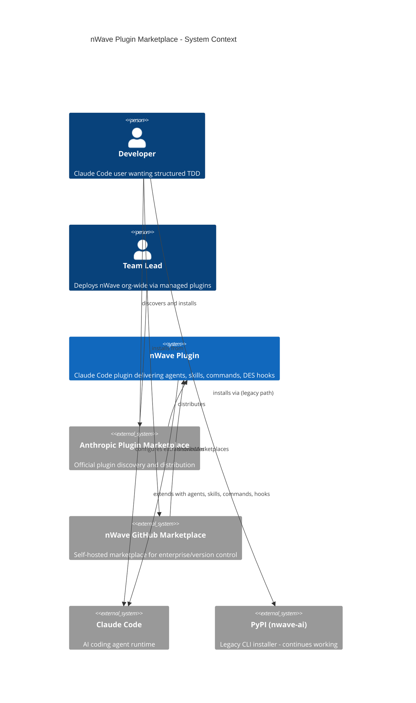
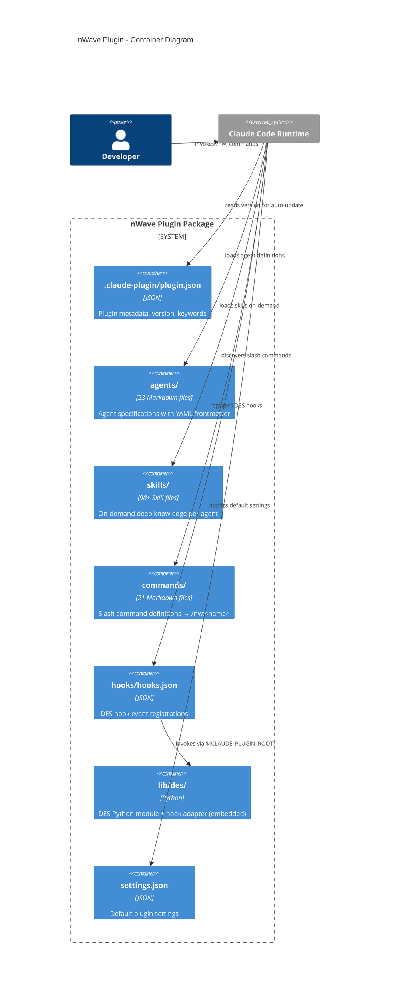
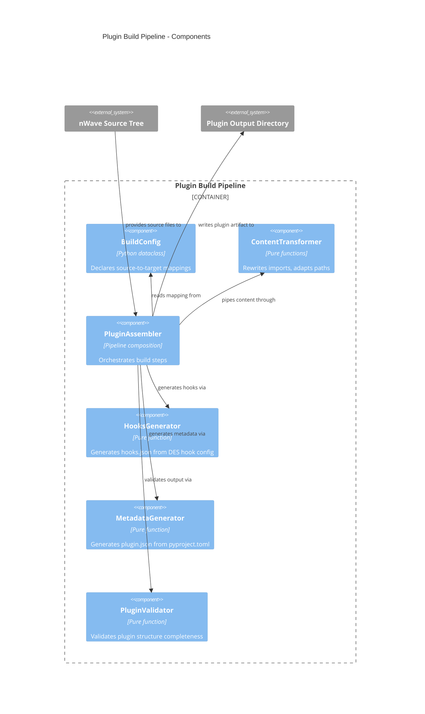

# Architecture Design: nWave Plugin Marketplace (Phase 0.5)

**Date**: 2026-02-27
**Author**: Morgan (Solution Architect)
**Status**: Draft
**Paradigm**: Functional Programming

---

## System Context (C4 Level 1)



## Container Diagram (C4 Level 2)



## Component Diagram (C4 Level 3) - Build Pipeline

The build pipeline is the only new component with internal complexity worth detailing. The plugin itself is a static artifact.



---

## Component Architecture

### Component Boundaries

| Component | Responsibility | Input | Output |
|-----------|---------------|-------|--------|
| **Plugin Build Pipeline** | Transform nWave source tree into plugin-compatible directory | nWave source tree + pyproject.toml | Plugin directory artifact |
| **Plugin Package** (static) | Deliver nWave to Claude Code runtime | Plugin directory | Agents, skills, commands, hooks active in Claude Code |
| **DES Bundle** | Run DES enforcement within plugin sandbox | Hook invocations from Claude Code | Allow/block decisions via exit codes |
| **CI/CD Extension** | Automate plugin builds and marketplace submission | Git tags/releases | Published plugin versions |

### Key Architectural Decisions

**1. Build artifact, not symlink**: The plugin is a generated build artifact. The source tree structure (`nWave/tasks/nw/`, `nWave/agents/`, `nWave/skills/{agent}/`) does not match the plugin spec (`commands/`, `agents/`, `skills/{name}/SKILL.md`). A build step transforms the structure.

**2. DES as self-contained bundle**: The DES Python module is copied into the plugin's `lib/des/` directory with imports rewritten. Hooks reference it via `${CLAUDE_PLUGIN_ROOT}/lib/des/`. No external PYTHONPATH dependency.

**3. Skills direct copy (no SKILL.md rename)**: Claude Code's plugin system auto-discovers skills from `skills/` directories. nWave skills use individual `.md` filenames (not `SKILL.md`). The plugin system discovers all `.md` files in skill subdirectories -- no renaming needed.

**4. Coexistence via scope isolation**: Plugin installs to `~/.claude/plugins/cache/nwave/`. Custom installer installs to `~/.claude/agents/nw/`, `~/.claude/commands/nw/`, `~/.claude/skills/nw/`. Different paths = no conflict. Users choose one or both.

---

## Integration Patterns

### Build Pipeline Integration

```
pyproject.toml (version) ──> MetadataGenerator ──> plugin.json
nWave/agents/*.md ─────────> copy ──────────────> agents/*.md
nWave/tasks/nw/*.md ───────> copy ──────────────> commands/*.md
nWave/skills/*/*.md ───────> copy + SKILL.md ──> skills/{agent}/{skill}/SKILL.md
src/des/ ──────────────────> rewrite + copy ────> lib/des/
DES hook config ───────────> HooksGenerator ────> hooks/hooks.json
```

### Hook Invocation Flow (Plugin Mode)

```
Claude Code ──PreToolUse──> hooks.json
  ├── matcher: "Task" ──> ${CLAUDE_PLUGIN_ROOT}/scripts/des-hook pre-task
  ├── matcher: "Write" ──> ${CLAUDE_PLUGIN_ROOT}/scripts/des-hook pre-write
  └── matcher: "Edit" ──> ${CLAUDE_PLUGIN_ROOT}/scripts/des-hook pre-edit

des-hook (shell wrapper):
  PYTHONPATH=${CLAUDE_PLUGIN_ROOT}/lib \
  python3 -m des.adapters.drivers.hooks.claude_code_hook_adapter $ACTION
```

### Version Synchronization

```
pyproject.toml [project.version] = "1.2.0"
         │
         ├──> build_plugin.py reads version
         │         │
         │         └──> .claude-plugin/plugin.json { "version": "1.2.0" }
         │
         └──> release.yml triggers plugin build on tag
```

---

## Quality Attribute Strategies

### Time-to-Market (Primary)

- Reuse existing `build_dist.py` patterns for plugin builder
- Plugin structure maps 1:1 to existing nWave components -- minimal transformation
- No new runtime code -- DES module is copied as-is with import rewriting (already implemented in `des_plugin.py`)

### Maintainability (Secondary)

- Single build script (`build_plugin.py`) owns all transformation logic
- Version derived from single source of truth (`pyproject.toml`)
- CI/CD automatically builds plugin on release -- no manual steps

### Testability (Tertiary)

- Build pipeline is pure functions (input source tree, output plugin directory) -- trivially testable
- Plugin structure validated by `PluginValidator` comparing output against expected manifest
- Integration test: build plugin, verify Claude Code can load it

---

## Deployment Architecture

### Build and Distribution Flow

```
Developer pushes tag v1.2.1
  └──> release.yml
         ├──> existing: build dist/, GitHub Release, PyPI
         └──> NEW: build_plugin.py
                ├──> generates plugin/ directory
                ├──> commits to nwave-ai/nwave-plugin repo
                ├──> submits to Anthropic marketplace (manual first time, auto-update after)
                └──> updates own marketplace manifest
```

### Enterprise Distribution

```
Organization settings.json:
{
  "extraKnownMarketplaces": ["github@nwave-ai/nwave-plugin"],
  "enabledPlugins": { "nwave": { "scope": "managed" } }
}
```

---

## Security Architecture

### DES Hook Execution Boundaries

DES hooks execute inside the plugin sandbox with the following constraints:

**File I/O scope**: Hooks read/write only to the project working directory (`.nwave/des/` for session state, execution logs). They do not modify plugin files, settings.json, or files outside the project root.

**Process model**: Hooks run as child processes of Claude Code with the same user permissions. PYTHONPATH is set to `${CLAUDE_PLUGIN_ROOT}/lib/des/` — isolated from system Python packages and from the custom installer's `~/.claude/lib/python`.

**Dependency ownership**: DES requires `pyyaml` for YAML parsing (execution logs, roadmap schemas). Two mitigation strategies:
1. **Primary**: Migrate execution-log and roadmap from YAML to JSON (already implemented on `feat/claude-code-plugin` branch — see Prior Art). This eliminates the pyyaml dependency entirely.
2. **Fallback**: If YAML files remain, hooks fail with exit code 1 and stderr message "DES error: pyyaml not installed. Run: pip install pyyaml". Claude Code surfaces this to the user.

**Silent failure prevention**: All hook scripts check dependencies at startup and emit diagnostic errors to stderr before failing. Claude Code displays stderr content to the user on hook failure.

**Settings.json access**: Hooks do NOT read or modify the user's settings.json. Hook registration is static in hooks/hooks.json — no runtime permission escalation.

---

## Prior Art: feat/claude-code-plugin Branch

A previous implementation exists on `feat/claude-code-plugin` (11 commits, 67 files changed). Key reusable components:

| Component | File | Status | Reuse? |
|-----------|------|--------|--------|
| **sync_to_plugin.py** (409 lines) | `scripts/sync_to_plugin.py` | Working | **YES** — rename to `build_plugin.py`, refactor to FP style |
| **YAML→JSON migration** | Multiple DES files | Merged to branch | **YES** — eliminates pyyaml dependency |
| **E2E validation** | `tests/e2e/plugin-install/validate.py` | Working | **YES** — structural validation for plugin |
| **E2E Dockerfile** | `tests/e2e/plugin-install/Dockerfile` | Working | **YES** — containerized install test |
| **Hook JSON generation** | Inside sync_to_plugin.py | Working | **YES** — hooks.json template with `${CLAUDE_PLUGIN_ROOT}` |
| **Skills→SKILL.md conversion** | Inside sync_to_plugin.py | Working | **REVIEW** — current branch wraps each skill in SKILL.md; may not be needed |
| **Plugin name = "nw"** | Manifest | Working | **YES** — gives `/nw:deliver` naming convention |
| **DES embedding** | Inside sync_to_plugin.py | Working | **YES** — copy + import rewriting |

**Key learnings from prior work**:
1. Plugin name must be `"nw"` (not `"nwave"`) to get correct `/nw:<command>` namespace
2. Commands must be in `commands/` directory (not `skills/`) for proper slash-command registration
3. Marketplace source field must start with `./` per Claude Code validation
4. DES must be embedded inside plugin (not as separate MCP server) for coercive enforcement
5. `systemMessage` field is NOT supported in hook responses — removed in prior fix

**Impact on roadmap**: Prior art reduces steps 01-01 and 01-02 to refactoring tasks rather than greenfield development. Estimated effort reduction: ~40%.

---

## Rejected Simple Alternatives

### Alternative 1: Symlink source directories into plugin structure

- **What**: Create symbolic links from plugin/ directories to nWave/ source
- **Expected Impact**: 100% of problem (zero build step)
- **Why Insufficient**: Plugins are COPIED to `~/.claude/plugins/cache/` -- symlinks resolve to absolute paths that break on distribution. Also, directory structure mismatch (`tasks/nw/` vs `commands/nw/`) cannot be resolved with symlinks.

### Alternative 2: Manual directory arrangement (no build script)

- **What**: Restructure nWave/ to match plugin layout directly
- **Expected Impact**: 90% (eliminates build step)
- **Why Insufficient**: Would break the existing custom installer which expects `nWave/tasks/nw/` for commands. Also breaks all CI/CD scripts, documentation generators, and 100+ internal references. The cost of restructuring exceeds the cost of a build script.

### Why Build Pipeline Necessary

1. Source layout differs from plugin layout (tasks/ vs commands/, skills namespacing)
2. DES module requires import rewriting (`from src.des` to `from des`)
3. Hook commands differ (`$HOME/.claude/lib/python` vs `${CLAUDE_PLUGIN_ROOT}/scripts/des`)
4. Version must be injected from pyproject.toml into plugin.json
5. Build script is ~200 lines, runs in <5 seconds, fully testable

---

## Implementation Roadmap

### Estimated Production Files

| File | Type |
|------|------|
| `scripts/build_plugin.py` | Build pipeline (main deliverable) |
| `plugin/.claude-plugin/plugin.json` | Generated metadata |
| `plugin/hooks/hooks.json` | Generated hook config |
| `plugin/lib/des/` | Embedded DES module (generated) |
| `plugin/settings.json` | Generated settings |
| `.github/workflows/release.yml` | Extended (add plugin build job) |

~6 production files. Steps/files ratio target: <= 2.5.

```yaml
roadmap:
  project_id: "nwave-plugin-marketplace"
  paradigm: "functional"
  estimated_steps: 5
  estimated_files: 6

  phases:
    "01":
      title: "Plugin Build Pipeline"
      steps:
        "01-01":
          title: "Plugin assembler with metadata generation"
          description: >
            Build pipeline that reads nWave source tree and generates
            plugin directory with plugin.json, copying agents/skills/commands.
          acceptance_criteria:
            - "Plugin directory contains .claude-plugin/plugin.json with version from pyproject.toml"
            - "All 23 agent files present in plugin/agents/"
            - "All 98+ skill files present in plugin/skills/ preserving directory structure"
            - "All 22 command files present in plugin/commands/nw/"
          architectural_constraints:
            - "Pure function pipeline: config -> source tree -> plugin directory"
            - "Version derived from pyproject.toml (single source of truth)"
            - "No new dependencies beyond stdlib"

        "01-02":
          title: "DES bundle with hooks generation"
          description: >
            Bundle DES module into plugin with import rewriting.
            Generate hooks.json and shell wrapper using CLAUDE_PLUGIN_ROOT.
          acceptance_criteria:
            - "DES module importable from plugin/scripts/des/"
            - "hooks.json registers PreToolUse, PostToolUse, SubagentStop, SessionStart, SubagentStart"
            - "DES enforcement returns allow/block decisions with error messages on phase violations"
            - "DES runtime templates (TDD schema, roadmap schema) bundled in plugin"
          architectural_constraints:
            - "Import rewriting: from src.des -> from des (reuse existing regex patterns)"
            - "Hook commands use ${CLAUDE_PLUGIN_ROOT}, never $HOME"
            - "Shell wrapper is thin (< 10 lines)"

        "01-03":
          title: "Plugin validation and build verification"
          description: >
            Validate generated plugin structure against expected manifest.
            Verify all components present and hooks.json syntactically valid.
          acceptance_criteria:
            - "Build fails if any expected component is missing"
            - "hooks.json validates against expected schema"
            - "Plugin structure matches Claude Code plugin spec"
          architectural_constraints:
            - "Validation is a pure function: plugin directory -> Result<Valid, Errors>"

    "02":
      title: "CI/CD and Distribution"
      steps:
        "02-01":
          title: "Release pipeline extension"
          description: >
            Extend release.yml to build plugin on release tag,
            publish to nwave-plugin repo, generate marketplace manifest.
          acceptance_criteria:
            - "Plugin builds automatically on release tag"
            - "Plugin directory committed to nwave-plugin repository"
            - "Marketplace manifest generated for self-hosted marketplace"
          architectural_constraints:
            - "Plugin build step runs after existing dist build"
            - "Version in plugin.json matches release version"

        "02-02":
          title: "Coexistence verification and migration guide"
          description: >
            Verify plugin and custom installer coexist without conflicts.
            Document migration path from custom installer to plugin.
          acceptance_criteria:
            - "Install plugin + custom installer simultaneously, run /nw:deliver, verify both discovered correctly"
            - "No duplicate hook registrations (single PreToolUse/PostToolUse/SubagentStop per event)"
            - "Disable plugin → custom installer still works; disable installer → plugin still works"
            - "Migration guide documents switchover procedure with verification steps"
          architectural_constraints:
            - "Plugin and installer use different directory paths"
            - "No modifications to existing custom installer"

  implementation_scope:
    new_files:
      - "scripts/build_plugin.py"
    modified_files:
      - ".github/workflows/release.yml"
    generated_files:
      - "plugin/.claude-plugin/plugin.json"
      - "plugin/hooks/hooks.json"
      - "plugin/scripts/des-hook"
      - "plugin/settings.json"

  validation:
    step_ratio: "5 steps / 6 files = 0.83 (well under 2.5 limit)"
    pattern_batching: "Steps 01-01 through 01-03 have distinct concerns (copy, DES, validate)"
```

---

## Handoff to Acceptance Designer

### Architecture Summary for DISTILL Wave

**What**: Build pipeline (`scripts/build_plugin.py`) transforms nWave source into Claude Code plugin format. 5 roadmap steps, 6 production files.

**Key Decisions** (see ADRs):
- ADR-001: Plugin marketplace as primary distribution, CLI as legacy
- ADR-002: DES bundled self-contained in `lib/des/`, `${CLAUDE_PLUGIN_ROOT}` paths
- ADR-003: Skills copied as-is, no SKILL.md rename, no namespace prefix

**Development Paradigm**: Functional Programming. Pure function pipelines. Types-first. Effect boundaries at file I/O only.

**Component Boundaries**:
- `build_plugin.py` owns all transformation logic
- Plugin package is a static artifact (no runtime build logic)
- Custom installer unchanged
- CI/CD extended with one additional job

**Quality Attributes** (priority order):
1. Time-to-market: reuse existing patterns from `build_dist.py` and `des_plugin.py`
2. Maintainability: single build script, version from single source
3. Testability: pure functions, validated output structure
