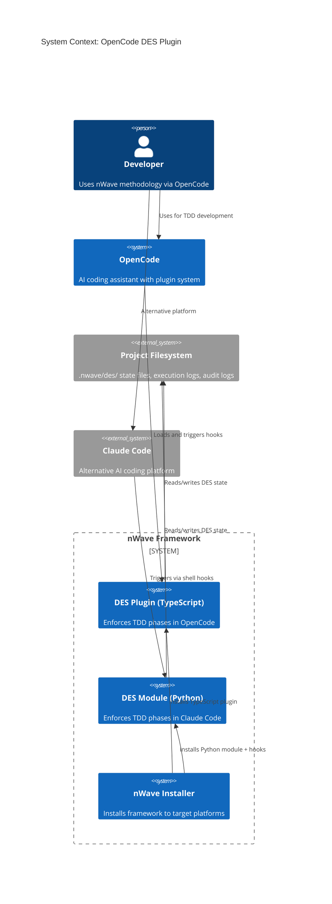
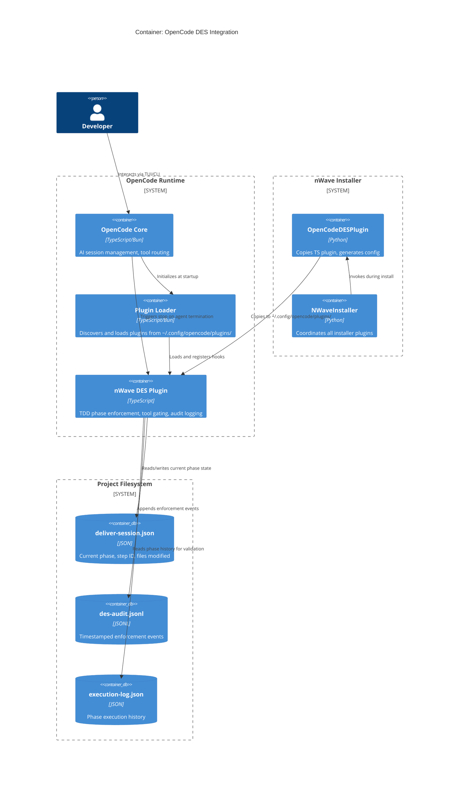
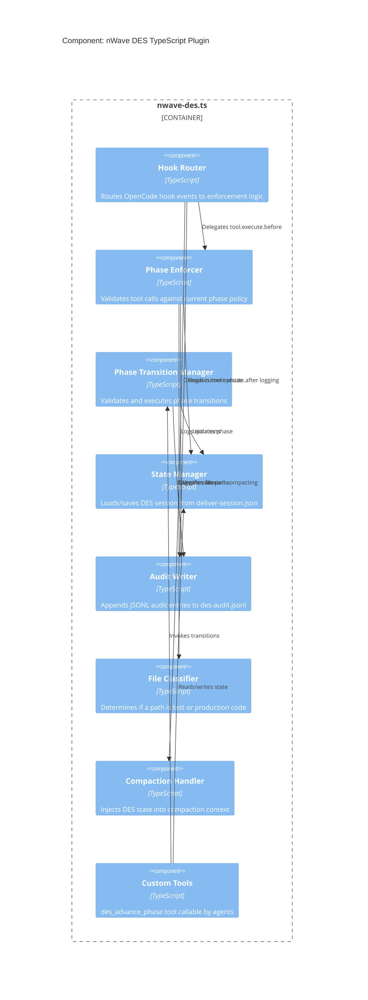

# Architecture Design: OpenCode DES Plugin

**Feature**: opencode-des
**Date**: 2026-03-03
**Architect**: nw-solution-architect (Morgan)
**Status**: Draft (Rev 2 -- post-review)

---

## System Context and Capabilities

The OpenCode DES plugin extends nWave's Deterministic Execution System to the OpenCode AI coding assistant. It replicates the TDD phase enforcement currently provided by the Python-based DES in Claude Code, using OpenCode's native TypeScript plugin system.

**Core capabilities:**
- TDD 5-phase enforcement (PREPARE, RED_ACCEPTANCE, RED_UNIT, GREEN, COMMIT)
- Tool-level blocking based on phase rules (write/edit restrictions per phase)
- File-based state persistence compatible with existing `.nwave/des/` layout
- JSONL audit logging matching existing DES audit format
- Phase transition validation with allowed-transition rules
- Context preservation across compactions

---

## C4 System Context (L1)



---

## C4 Container (L2)



---

## C4 Component (L3) -- TypeScript DES Plugin Internals



---

## Hook Mapping: Claude Code to OpenCode

| DES Function | Claude Code Hook | OpenCode Hook | Behavior | Parity |
|---|---|---|---|---|
| Pre-task validation | `PreToolUse(Task)` | `tool.execute.before` (filter: tool === "task") | Parse DES markers, validate max_turns, check prompt structure | MATCH -- Python DES equivalent |
| Write/Edit session guard | `PreToolUse(Write)`, `PreToolUse(Edit)` | `tool.execute.before` (filter: tool === "write" or "edit") | Block source writes outside DES subagent (SessionGuardPolicy) | MATCH -- both block non-DES source writes |
| Write/Edit phase guard | (not in Python DES) | `tool.execute.before` (filter: tool === "write" or "edit") | Enforce RED=test-only, GREEN=production-only, COMMIT=no-new-files | NEW -- OpenCode-exclusive enhancement |
| Post-task audit | `PostToolUse(Task)` | `tool.execute.after` (filter: tool === "task") | Log task completion, track files modified | MATCH -- Python DES equivalent |
| Subagent stop validation | `SubagentStop` | `stop` | Validate phase completion before agent terminates | MATCH -- Python DES equivalent |
| Session start | `SessionStart` | (plugin init function) | Load session state, check for stale executions | MATCH -- Python DES equivalent |
| Compaction context | (not available in Claude Code) | `experimental.session.compacting` | Inject DES state into compaction summary | NEW -- OpenCode-exclusive (no Claude Code equivalent) |

### Gaps and Mitigations

| Gap | Description | Mitigation |
|---|---|---|
| `SubagentStart` | Claude Code fires this when a subagent starts. No OpenCode equivalent. | Not critical -- DES markers in agent prompts handle initialization. Plugin init handles session loading. |
| `SessionStart` matchers | Claude Code supports `startup\|resume\|clear\|compact` matchers. OpenCode plugin init runs once. | Plugin init function replaces session-start. State reload handled by reading session file on each hook. |
| Blocking semantics | Claude Code hooks return exit codes (0=allow, 2=block). OpenCode hooks throw Error to block. | Map `HookDecision.block()` to `throw new Error(reason)`. Map `HookDecision.allow()` to normal return. |
| Hook input format | Claude Code sends JSON on stdin. OpenCode passes typed `(input, output)` parameters. | TypeScript plugin receives structured objects directly -- simpler than Claude Code's stdin/stdout JSON. |

---

## Phase Enforcement Model

> **NEW FEATURE -- Not Present in Python DES**
>
> Phase-aware file classification (blocking production writes in RED, test writes in GREEN) is a **new enforcement capability** that does not exist in the Python DES. The Python DES enforces: (1) DES markers present on step-id tasks, (2) max_turns policy, (3) marker completeness, (4) prompt structure validation, and (5) source writes must go through DES subagent (`SessionGuardPolicy`). The `SessionGuardPolicy` blocks source/test writes by the orchestrating agent when a deliver session is active but no DES-monitored subagent is running. It does NOT distinguish test vs production files or enforce RED/GREEN phase tool policies.
>
> The TypeScript plugin adds phase-granular enforcement as an OpenCode-exclusive enhancement. This is a behavioral divergence from the Python DES -- agents on Claude Code rely on prompt instructions and TDD methodology to maintain phase discipline, while OpenCode agents get tool-level enforcement.

### TDD 5-Phase Cycle (v4.0)

```
NOT_STARTED -> PREPARE -> RED_ACCEPTANCE -> RED_UNIT -> GREEN -> COMMIT -> COMPLETED
```

### Tool Restrictions Per Phase

| Phase | Write (test) | Write (prod) | Edit (test) | Edit (prod) | Bash | Read/Glob/Grep |
|---|---|---|---|---|---|---|
| PREPARE | Allowed | Allowed | Allowed | Allowed | Allowed | Allowed |
| RED_ACCEPTANCE | Allowed | **Blocked** | Allowed | **Blocked** | Allowed | Allowed |
| RED_UNIT | Allowed | **Blocked** | Allowed | **Blocked** | Allowed | Allowed |
| GREEN | **Blocked** | Allowed | **Blocked** | Allowed | Allowed | Allowed |
| COMMIT | Blocked (new files) | Blocked (new files) | Allowed | Allowed | Allowed | Allowed |

### Violation Detection

The Phase Enforcer intercepts `tool.execute.before` and:
1. Loads current session state from `deliver-session.json`
2. If no active session: allows all tools (no DES enforcement)
3. Extracts the file path from `output.args.filePath` for write/edit tools
4. Classifies the file as test or production using File Classifier
5. Checks the phase tool policy matrix
6. If violation detected: logs audit event, throws Error with descriptive message
7. If allowed: returns normally (no throw = allow)

### Stale Session Detection

On each `tool.execute.before`, the plugin checks the `startedAt` timestamp from the session state:

| Age | Severity | Action |
|---|---|---|
| < 4 hours | None | Normal enforcement |
| 4-24 hours | Warning | Log warning to audit, continue enforcement (do not block) |
| > 24 hours | Error | Log error to audit, suggest running `des_advance_phase("NOT_STARTED", "Session expired")` to reset |

This is lighter than the Python DES's `StaleExecutionDetector` (which fully blocks stale sessions). OpenCode's in-process model makes lightweight staleness checks cheap -- no subprocess startup cost per check.

### Known Limitation: Bash Tool Bypass

The Bash tool can execute arbitrary shell commands including file writes (`echo >> src/main.ts`). Phase enforcement only intercepts Write and Edit tool calls, not Bash commands that modify files.

**Mitigations considered**:

- **OPTION A (blocking Bash)**: Rejected -- would prevent running tests (`pytest`, `npm test`), which is essential in every phase
- **OPTION B (parsing Bash commands)**: Rejected -- fragile and error-prone (infinite shell command variations: `tee`, `sed -i`, `>`, `>>`, `cat >`, pipes, etc.)
- **OPTION C (agent prompt instructions)**: Chosen -- agent prompts during RED phases include explicit instruction: "Do not use Bash to write or modify files. Use only Write/Edit tools so DES can enforce phase discipline."

**Rationale**: OPTION C relies on agent compliance, matching the Python DES's cooperative enforcement model. The Python DES also does not intercept Bash-based file modifications -- this is a known and accepted limitation across both platforms.

### Phase Transition Rules

Transitions follow the schema's `valid_transitions` map. The `des_advance_phase` custom tool validates:
- Current phase has a valid transition to the requested next phase
- Evidence string is provided (why current phase is complete)
- State is persisted after transition
- Audit event logged with from/to/evidence

---

## State Persistence Model

### Location

```
{project_root}/.nwave/des/
  deliver-session.json    # Active session state
  logs/
    des-audit.jsonl       # Audit log (append-only)
```

### Session State Schema (`deliver-session.json`)

```json
{
  "featureId": "opencode-des",
  "stepId": "01-03",
  "currentPhase": "GREEN",
  "turnCount": 12,
  "startedAt": "2026-03-03T10:00:00Z",
  "phaseHistory": [
    { "phase": "PREPARE", "timestamp": "2026-03-03T10:00:00Z", "evidence": "Fixtures set up" },
    { "phase": "RED_ACCEPTANCE", "timestamp": "2026-03-03T10:05:00Z", "evidence": "Acceptance test fails" },
    { "phase": "RED_UNIT", "timestamp": "2026-03-03T10:10:00Z", "evidence": "3 unit tests fail" },
    { "phase": "GREEN", "timestamp": "2026-03-03T10:15:00Z", "evidence": "Implementing" }
  ],
  "filesModified": ["src/des/domain/phase.ts", "src/des/application/enforcer.ts"],
  "testsRan": false
}
```

### Write Strategy: Atomic Rename

State writes use a write-to-temp + rename strategy to prevent corruption:

1. Write new state to `deliver-session.json.tmp` (same directory)
2. Call `fs.renameSync()` to atomically replace `deliver-session.json` (atomic on POSIX, near-atomic on Windows)

On read failure (JSON parse error): retry once after 50ms. This handles the rare case where a read coincides with a mid-rename operation.

Single-developer single-session is the expected deployment. Multi-session on the same project is unsupported but safe (last-write-wins with no corruption due to atomic rename).

### Audit Log Format (`des-audit.jsonl`)

Each line is a JSON object in JSONL format. The TypeScript plugin uses its own field naming convention (camelCase, flat structure) rather than mimicking the Python DES's nested format.

**Field-by-field comparison with Python DES**:

| Field | Python DES (`AuditEvent`) | TypeScript Plugin | Match |
|---|---|---|---|
| Event classification | `event_type` (str, e.g., "HOOK_PRE_TOOL_USE_BLOCKED") | `event` (string, e.g., "tool_blocked") | RENAME: different field name and value convention |
| Timestamp | `timestamp` (str, ISO 8601) | `timestamp` (string, ISO 8601) | YES |
| Feature identifier | `feature_name` (str, optional) | `featureId` (string, optional) | RENAME: different field name |
| Step identifier | `step_id` (str, optional) | `stepId` (string, optional) | RENAME: different casing |
| Correlation ID | `hook_id` (str, optional) | Not applicable | GAP: OpenCode hooks do not have correlation IDs |
| Event-specific data | `data` (dict, e.g., `{"reason": "..."}`) | Inline fields (tool, phase, file, reason) | DIVERGENCE: Python wraps in `data` dict, TS uses flat fields |

**Decision**: TypeScript plugin uses its own field names (camelCase, flat structure). Both write to JSONL. A unified parser would need to handle both schemas. This is acceptable -- audit logs are per-platform, not cross-platform.

**TypeScript audit examples**:

```json
{"event":"tool_blocked","tool":"write","phase":"RED_ACCEPTANCE","file":"src/main.ts","reason":"Cannot modify production file during RED phase","featureId":"opencode-des","stepId":"01-03","timestamp":"2026-03-03T10:07:00Z"}
{"event":"phase_advanced","from":"RED_UNIT","to":"GREEN","evidence":"3 unit tests created and failing","featureId":"opencode-des","stepId":"01-03","timestamp":"2026-03-03T10:15:00Z"}
{"event":"tool_executed","tool":"bash","phase":"GREEN","featureId":"opencode-des","stepId":"01-03","timestamp":"2026-03-03T10:20:00Z"}
```

### Compatibility with Claude Code DES

Both platforms read/write the same `.nwave/des/` directory structure. A developer can switch between Claude Code and OpenCode on the same project without losing DES state. The session format is a superset -- fields not recognized by one platform are ignored by the other.

### Session Initialization

The DES plugin is a passive enforcer -- it reads state, it does not create sessions. Session state is created by the orchestrating agent before subagent dispatch.

**Bootstrap flow**:

1. The nWave orchestrator (main agent running `/nw:deliver`) calls the `des_create_session` custom tool with featureId, stepId, and initial phase=NOT_STARTED
2. This creates `deliver-session.json` in `.nwave/des/` with startedAt timestamp and empty phaseHistory
3. The orchestrator dispatches a subagent (software-crafter) with step context
4. The subagent calls `des_advance_phase("PREPARE", "Starting step execution")` to begin the TDD cycle
5. On each subsequent hook fire, the plugin reads session state from `deliver-session.json` -- it does not need DES markers because the state file already contains all context (featureId, stepId, currentPhase)

**Why no DES markers**: In Claude Code, DES markers are embedded in Task tool prompts and parsed by `DesMarkerParser` to identify DES-managed tasks. OpenCode's model is different -- the session file IS the state, and the plugin enforces on every tool call within that session. There is no need to parse markers from subagent prompts.

**Behavioral divergence**: The TypeScript plugin enforces phase-granular file restrictions (RED=test-only writes, GREEN=production-only writes) that the Python DES does not enforce at the tool level. The Python DES's `SessionGuardPolicy` only blocks source writes that bypass a DES subagent -- it does not distinguish test vs production files. This means:
- An agent on Claude Code in RED phase CAN write to a production file (DES relies on agent discipline)
- An agent on OpenCode in RED phase CANNOT write to a production file (plugin throws Error)

This is an intentional enhancement, not a parity issue. The shared state format is compatible -- only enforcement strictness differs.

---

## Python Installer Plugin Design

### Class: `OpenCodeDESPlugin(InstallationPlugin)`

**Priority**: 39 (after opencode-commands at 38, before DES at 50)
**Dependencies**: `["opencode-commands"]` -- DES plugin depends on OpenCode being properly set up (commands plugin ensures the OpenCode config directory exists and is functional). DES does not depend on skills or agents -- it enforces on any subagent. If opencode-commands has not installed successfully, `OpenCodeDESPlugin` will fail at `verify()` because the target directory will not exist.

### What It Installs

| Artifact | Source | Target |
|---|---|---|
| DES plugin TypeScript | `src/des/opencode-plugin.ts` | `~/.config/opencode/plugins/nwave-des.ts` |

### Install Flow

1. Locate source TypeScript file from `context.framework_source / "des" / "opencode-plugin.ts"` (dist) or `context.project_root / "src" / "des" / "opencode-plugin.ts"` (dev)
2. Create target directory `~/.config/opencode/plugins/` if not exists
3. Copy `opencode-plugin.ts` to target as `nwave-des.ts`
4. Write manifest (`.nwave-des-manifest.json`) for uninstall tracking

### Verify Flow

1. Check `~/.config/opencode/plugins/nwave-des.ts` exists
2. Read manifest and verify listed files present
3. Basic content check: verify file contains `"tool.execute.before"` string

### Uninstall Flow

1. Read manifest to identify installed files
2. Remove `nwave-des.ts` from plugins directory
3. Remove manifest file

### Plugin Pattern

Follows the exact pattern established by `OpenCodeAgentsPlugin`, `OpenCodeCommandsPlugin`, and `OpenCodeSkillsPlugin`:
- Module-level `_opencode_*_dir()` function for target path
- Module-level `_find_*_source()` function for source discovery
- Module-level `_write_manifest()` / `_read_manifest()` for tracking
- Class with `install()`, `uninstall()`, `verify()` methods
- Manifest-based uninstall to avoid touching user files

### Registration in `install_nwave.py`

```python
# In _create_plugin_registry():
if target_platforms and "opencode" in target_platforms:
    # ... existing OpenCode plugins ...
    opencode_des = OpenCodeDESPlugin()
    registry.register(opencode_des)
    opencode_des.set_dependencies(["opencode-commands"])
```

### Error Recovery

If installation fails, the error is logged and the installer continues with remaining plugins. DES enforcement is optional -- nWave works without it (agents just lack TDD discipline enforcement). The user can re-run installation to retry.

---

## Technology Stack

| Component | Technology | License | Rationale |
|---|---|---|---|
| DES Plugin | TypeScript (Bun runtime) | N/A (project code) | OpenCode's native plugin language; zero external deps |
| State persistence | JSON (Node.js `fs` module) | N/A (stdlib) | Compatible with existing `.nwave/des/` format |
| Audit logging | JSONL (append via `fs.writeFileSync`) | N/A (stdlib) | Matches Python DES audit format |
| Installer plugin | Python 3.10+ | N/A (project code) | Matches existing installer plugin system |
| File I/O | `fs` (Node.js/Bun built-in) | MIT (Node.js) | Zero npm dependencies required |

---

## Pre-Implementation Validation (PoC Gate)

Before full implementation begins, a minimal proof-of-concept must validate that OpenCode's plugin system supports blocking semantics as assumed by this design.

**PoC scope**: A ~20-line TypeScript plugin that registers a `tool.execute.before` hook and throws `new Error("PoC: blocked by DES test")` when the Write tool is invoked.

**PoC must verify**:
1. The thrown Error is caught by OpenCode (no unhandled exception crash)
2. The Write tool execution is actually prevented (file not written)
3. The error message appears in the agent UI or logs (agent receives feedback about the block)

**Gate**: Implementation MUST NOT proceed until PoC confirms blocking semantics on OpenCode v1.2.15. If blocking via `throw Error` does not work, the entire hook-based enforcement model is invalid and an alternative approach is needed.

---

## Integration Patterns

### OpenCode Plugin Registration

OpenCode discovers plugins from `~/.config/opencode/plugins/` directory. Each `.ts` file exporting a `Plugin` type is auto-loaded at session start. No configuration file modification needed -- file presence is sufficient.

### Cross-Platform State Sharing

Both the Python DES (Claude Code) and TypeScript DES (OpenCode) operate on the same project-local `.nwave/des/` directory. State format compatibility ensures:
- Session started in Claude Code can be resumed in OpenCode
- Audit logs from both platforms appear in the same `.nwave/des/logs/` directory
- Execution logs maintain a unified phase history

### Hook Protocol Differences

| Aspect | Claude Code | OpenCode |
|---|---|---|
| Hook registration | `settings.json` entries | File in `plugins/` directory |
| Input format | JSON on stdin | Typed function parameters |
| Block mechanism | Exit code 2 | `throw new Error(msg)` |
| Allow mechanism | Exit code 0 | Normal return (no throw) |
| Process model | New subprocess per hook | In-process function call |
| Performance | ~50ms startup per hook | <1ms (in-process) |

---

## Quality Attribute Strategies

### Maintainability
- Single TypeScript file (~300 lines) with clear section boundaries
- Phase policy defined as a data structure, not conditional logic
- File classification rules match Python DES exactly

### Reliability
- Fail-open: if session state unreadable, allow all tools (no DES enforcement)
- File I/O errors caught and logged, never crash the plugin
- Phase transition validated against explicit transition map

### Performance
- File read on every `tool.execute.before` (~1ms for small JSON)
- In-process execution (no subprocess overhead like Claude Code)
- State file is small (<1KB), no caching needed

### Compatibility
- State format backward-compatible with Python DES
- Audit log format uses JSONL like Python DES, but with different field names (see Audit Format comparison table)
- Phase names and transition rules from canonical schema v4.0
- Phase-granular enforcement is stricter than Python DES (see Behavioral Divergence in State Persistence)

### Security
- Plugin reads/writes only project-local `.nwave/des/` directory
- No network access, no external dependencies
- No secrets or credentials in state files

---

## Deployment Architecture

```
~/.config/opencode/
  plugins/
    nwave-des.ts              # Single-file DES enforcement plugin
  agents/
    nw-software-crafter.md    # (installed by opencode-agents plugin)
    nw-researcher.md
    ...
  commands/
    nw-deliver.md             # (installed by opencode-commands plugin)
    ...
  skills/
    tdd-methodology/SKILL.md  # (installed by opencode-skills plugin)
    ...

{project}/
  .nwave/
    des/
      deliver-session.json    # Active DES session (created by agent)
      logs/
        des-audit.jsonl       # Audit log (created by plugin)
    des-config.json           # DES configuration
```
