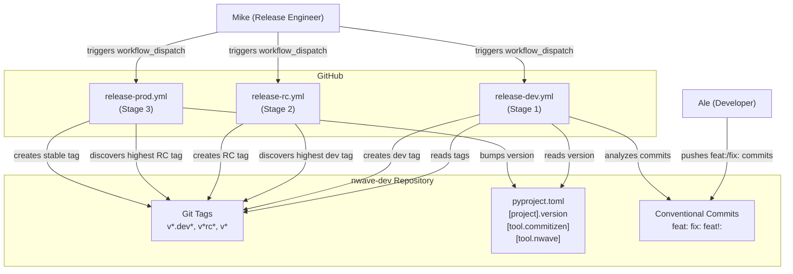

# Architecture: Commitizen Version Calculation for Release Train

**Feature**: release-commitizen
**Author**: Morgan (solution-architect)
**Date**: 2026-02-26
**Status**: DRAFT

---

## System Context

The nwave-dev release train produces PEP 440 versions across three stages: dev, RC, and stable. This feature replaces the hardcoded patch bump in Stage 1 (dev) with Commitizen-driven commit analysis, adds a version floor override, hardens fallback behavior, and **fully replaces PSR with CZ** across all release stages (US-CZ-05). PSR's three footprints (`.releaserc`, `[tool.semantic_release]`, `python-semantic-release` dependency) are removed. The legacy `release.yml` migrates from PSR to CZ commands.



## Container Diagram (C4 Level 2)

```mermaid
graph TB
    subgraph DevWorkflow["release-dev.yml (modified)"]
        CZStep["CZ Analysis Step\ncz bump --get-next\nOutputs: base version or empty"]
        FloorStep["Floor Read Step\nread_toml_field.py\nReads: tool.nwave.public_version"]
        VersionCalc["Version Calc Step\nnext_version.py --stage dev\nNew args: --base-version, --version-floor"]
        CurrentVer["Read Current Version\nread_toml_field.py\nReads: project.version"]
        GatherTags["Gather Dev Tags\ngit tag -l v*.dev*"]
    end

    subgraph ExistingScripts["scripts/release/ (minimal changes)"]
        NextVersion["next_version.py\ncalculate_dev() modified\n+2 CLI args, priority chain"]
        ReadToml["read_toml_field.py\n(no changes)"]
        DiscoverTag["discover_tag.py\n(no changes)"]
    end

    subgraph Config["pyproject.toml (config changes)"]
        CZConfig["[tool.commitizen]\nversion_scheme = pep440\nversion_provider = pep621\n+version_files\n+changelog_file"]
        NwaveConfig["[tool.nwave]\npublic_version (existing)"]
        ProjectVer["[project].version\n(existing, unchanged)"]
        PSRRemoved["[tool.semantic_release]\nDELETED (all sub-sections)"]
        DepRemoved["python-semantic-release\nREMOVED from dev deps"]
    end

    subgraph LegacyWorkflow["release.yml (migrated)"]
        LegacyBump["version-bump job\ncz bump replaces\nsemantic-release version"]
        SyncPublic["sync-public job\nstrip regex updated:\n[tool.commitizen]"]
    end

    subgraph Deleted["Deleted Components"]
        Releaserc[".releaserc\nDELETED (Node.js PSR config)"]
    end

    subgraph Unchanged["Unchanged Components"]
        RCWorkflow["release-rc.yml"]
        ProdWorkflow["release-prod.yml"]
        CalcRC["calculate_rc()"]
        CalcStable["calculate_stable()"]
        CalcNwaveAI["calculate_nwave_ai()"]
    end

    CZStep -- "reads config" --> CZConfig
    CZStep -- "reads anchor version" --> ProjectVer
    CZStep -- "outputs base or empty" --> VersionCalc
    FloorStep -- "reads floor" --> NwaveConfig
    FloorStep -- "outputs floor" --> VersionCalc
    CurrentVer -- "reads version" --> ProjectVer
    CurrentVer -- "outputs current" --> VersionCalc
    GatherTags -- "outputs tag CSV" --> VersionCalc

    VersionCalc -- "calls" --> NextVersion

    LegacyBump -- "reads config" --> CZConfig
    LegacyBump -- "runs cz bump" --> ProjectVer
    SyncPublic -- "strips" --> CZConfig

    RCWorkflow -- "calls" --> DiscoverTag
    RCWorkflow -- "calls" --> CalcRC
    ProdWorkflow -- "calls" --> DiscoverTag
    ProdWorkflow -- "calls" --> CalcStable
```



## Component Boundaries

### Modified Components

| Component | File | Change Scope |
|-----------|------|-------------|
| `parse_args()` | next_version.py | Add `--base-version`, `--version-floor` args |
| `calculate_dev()` | next_version.py | Accept base_version + version_floor; implement priority chain |
| `main()` | next_version.py | Pass new args to `calculate_dev()` |
| `version-calc` job | release-dev.yml | Add CZ analysis step, floor read step, pass new args |
| `[tool.commitizen]` | pyproject.toml | Add config section + `version_files` + `changelog_file` |
| `version-bump` job | release.yml | Replace `semantic-release version` with `cz bump` commands |
| `sync-public` job | release.yml | Strip regex: `[tool.semantic_release]` -> `[tool.commitizen]` |
| rsync excludes | release.yml, release-rc.yml, release-prod.yml | Remove `.releaserc` from exclude lists |
| version-drift msg | ci.yml | Reference "commitizen" instead of "python-semantic-release" |
| version-bump desc | .github/workflows/README.md | Describe CZ as the version management tool |

### Removed Components

| Component | File | Reason |
|-----------|------|--------|
| `.releaserc` | repo root | Node.js PSR plugin config; CZ `version_files` replaces file-update behavior |
| `[tool.semantic_release]` | pyproject.toml | All sub-sections (branches.main, changelog, remote, publish) removed |
| `python-semantic-release>=9.0.0` | pyproject.toml dev deps | CZ is the sole version tool; PSR dependency no longer needed |

### Unchanged Components (explicitly)

| Component | File | Why Unchanged |
|-----------|------|--------------|
| `calculate_rc()` | next_version.py | Receives base from dev tag suffix stripping; no floor, no CZ |
| `calculate_stable()` | next_version.py | Receives base from RC tag suffix stripping; no floor, no CZ |
| `calculate_nwave_ai()` | next_version.py | Has its own floor logic; independent path |
| `_bump_patch()` | next_version.py | Preserved as fallback; not removed |
| `_bump_minor()` | next_version.py | Unused by this feature (CZ provides the bumped version) |
| `_highest_counter()` | next_version.py | Already filters by base version string match; handles escalation naturally |
| `_validate_version()` | next_version.py | Reused for base-version and floor validation |
| `discover_tag.py` | scripts/release/ | Already sorts by packaging.Version; handles post-escalation correctly |
| `read_toml_field.py` | scripts/release/ | Already reads any TOML key; used as-is for floor |
| `release-rc.yml` | .github/workflows/ | Does not consult floor; inherits base from dev tag (rsync exclude cleanup only) |
| `release-prod.yml` | .github/workflows/ | Does not consult floor; inherits base from RC tag (rsync exclude cleanup only) |
| `release-prod.yml` version-bump | .github/workflows/ | Uses `bump_version.py` (custom script), not PSR |
| build, github-release jobs | release.yml | Not affected; only version-bump and sync-public change |

## Technology Stack

| Technology | Version | License | Rationale |
|-----------|---------|---------|-----------|
| Commitizen | >=3.12.0 | MIT | Already installed as dev dep; native PEP 440 support via `version_scheme = "pep440"` |
| packaging | >=21.0 | Apache 2.0 / BSD | Already a runtime dep; PEP 440 version parsing and comparison |
| Python | >=3.10 | PSF | Project requirement |
| GitHub Actions | N/A | N/A | Existing CI/CD platform |

No new dependencies are introduced. Commitizen and packaging are already declared in pyproject.toml.

## Version Resolution Priority Chain

This is the core architectural decision. Within `calculate_dev()`, version base is resolved in this order:

```
Input: --base-version (from CZ), --version-floor (from pyproject.toml), --current-version (from pyproject.toml)

Step 1: Determine base
  IF --base-version is non-empty AND valid PEP 440:
    base = --base-version                    (CZ-driven)
  ELSE IF --base-version is non-empty AND invalid:
    EXIT code 2 with error                   (reject garbage)
  ELSE:
    base = _bump_patch(current_version)      (fallback, today's behavior)

Step 2: Apply floor override
  IF --version-floor is non-empty AND valid PEP 440:
    IF Version(floor) > Version(base):
      base = floor                           (floor wins)
  ELSE IF --version-floor is non-empty AND invalid:
    EXIT code 2 with error                   (reject garbage)

Step 3: Calculate dev counter
  counter = _highest_counter(existing_tags, base, "dev") + 1
  version = f"{base}.dev{counter}"
```

## Integration Patterns

### CZ Analysis Step (new in release-dev.yml)

```
CZ step pattern:
  BASE=$(cz bump --get-next 2>/dev/null) || BASE=""
  echo "base=$BASE" >> $GITHUB_OUTPUT

Key properties:
  - 2>/dev/null suppresses CZ stderr
  - || BASE="" absorbs any exit code (not installed, no config, no bump-worthy commits)
  - Empty output triggers fallback in next_version.py
  - Non-empty output is validated by next_version.py (PEP 440 check)
```

### Floor Read Step (new in release-dev.yml)

```
Floor step pattern:
  FLOOR=$(python scripts/release/read_toml_field.py \
    --file pyproject.toml --key tool.nwave.public_version) || FLOOR=""
  echo "floor=$FLOOR" >> $GITHUB_OUTPUT

Key properties:
  - read_toml_field.py already exists and handles missing keys (exit 1)
  - || FLOOR="" absorbs missing key scenario
  - Empty output means no floor override
```

### Data Flow Through Workflow

```
[project].version ---------> next_version.py --current-version
cz bump --get-next ---------> next_version.py --base-version
tool.nwave.public_version --> next_version.py --version-floor
git tag -l "v*.dev*" -------> next_version.py --existing-tags
                               |
                               v
                    JSON output: {version, tag, base_version, pep440_valid}
```

## Quality Attribute Strategies

| Attribute | Strategy |
|-----------|----------|
| **Correctness** | All versions validated via `packaging.version.Version` before output. PEP 440 compliance guaranteed by library, not string manipulation. |
| **Reliability** | Three-level fallback: CZ -> patch bump -> error. Pipeline never breaks on CZ failure. `|| BASE=""` pattern absorbs all CZ errors. |
| **Testability** | Subprocess test pattern (existing). All paths reachable via CLI args. No mocking needed; pure function with deterministic inputs. |
| **Simplicity** | 1 function modified, 2 CLI args added, config section expanded. PSR removal reduces total config surface. Net fewer moving parts. |
| **Backward compat** | Empty `--base-version` and `--version-floor` = today's exact behavior. Existing tests pass unchanged. `release.yml` observable behavior preserved (same inputs/outputs, different tool). |
| **Maintainability** | Single version tool (CZ) eliminates dual-config confusion. One tool to upgrade, one config to maintain. |

## Roadmap

### Step 01: CZ config + --base-version arg with priority chain

**Description**: Add `[tool.commitizen]` config to pyproject.toml. Add `--base-version` CLI arg to next_version.py. Modify `calculate_dev()` to use base-version when provided, falling back to `_bump_patch` when empty.

**Acceptance Criteria**:
- `--base-version "1.2.0"` produces `1.2.0.dev1` (CZ overrides patch bump)
- Empty `--base-version` produces `1.1.23.dev1` (fallback, same as today)
- Invalid `--base-version` exits code 2 with descriptive error
- Sequential counter works with CZ base (existing dev1 -> dev2)
- `[tool.commitizen]` section present in pyproject.toml with pep440 scheme

**Architectural Constraints**:
- `calculate_dev()` signature extended; `calculate_rc/stable/nwave_ai` untouched
- Validation reuses existing `_validate_version()` pattern

**Traceability**: US-CZ-01 scenarios 1-5, US-CZ-03 scenarios 3, 5

---

### Step 02: Version floor override in calculate_dev

**Description**: Add `--version-floor` CLI arg to next_version.py. Apply floor comparison after CZ/fallback resolution. Floor wins when higher than resolved base.

**Acceptance Criteria**:
- Floor "1.3.0" overrides CZ base "1.2.0" producing `1.3.0.dev1`
- Floor "1.1.0" is ignored when CZ base is "1.2.0"
- Floor overrides fallback when CZ fails (empty base + high floor)
- Invalid floor exits code 2 with descriptive error
- Empty floor applies no override

**Architectural Constraints**:
- Floor comparison uses `packaging.version.Version` for correct PEP 440 ordering
- Floor applies to dev stage only; `calculate_rc/stable` untouched

**Traceability**: US-CZ-02 scenarios 1-5, US-CZ-03 scenario 4

---

### Step 03: Mid-cycle escalation and counter reset validation

**Description**: Validate that when `--base-version` changes mid-cycle (patch to minor), `_highest_counter` naturally resets the dev counter because no tags match the new base. Validate tag coexistence.

**Acceptance Criteria**:
- Base change from "1.1.26" to "1.2.0" resets counter to dev1
- Old v1.1.26.dev* tags are ignored when base is "1.2.0"
- Multiple base versions coexist (v1.1.26.dev8 + v1.2.0.dev1)
- Reverted feat does not de-escalate (CZ scans all commits)

**Architectural Constraints**:
- No code changes expected; `_highest_counter` already filters by base match
- Tests prove existing behavior under escalation conditions

**Traceability**: US-CZ-01 scenarios 6-7, US-CZ-01b Gherkin scenarios

---

### Step 04: Workflow wiring (CZ + floor steps in release-dev.yml)

**Description**: Add CZ analysis step and floor read step to release-dev.yml `version-calc` job. Wire outputs as `--base-version` and `--version-floor` to next_version.py invocation.

**Acceptance Criteria**:
- CZ step runs `cz bump --get-next` with `|| BASE=""` fallback
- Floor step reads `tool.nwave.public_version` via read_toml_field.py
- Both values passed to next_version.py's new args
- `pip install` step includes commitizen alongside packaging
- Existing workflow structure (CI gate, build, tag, notify) unchanged

**Architectural Constraints**:
- `commitizen` added to pip install step (already a dev dependency)
- release-rc.yml and release-prod.yml remain untouched

**Traceability**: US-CZ-01 AC (workflow wiring), US-CZ-02 AC (floor read), US-CZ-03 scenarios 1-2

---

### Step 05: Full promotion chain validation (dev -> RC -> stable)

**Description**: Validate the complete three-stage promotion chain after mid-cycle escalation. Prove discover_tag picks the highest version by packaging.Version sort, RC strips dev suffix correctly, stable strips RC suffix correctly, and self-healing works.

**Acceptance Criteria**:
- discover_tag picks v1.2.0.dev2 over v1.1.26.dev8 (version sort, not string sort)
- calculate_rc strips v1.2.0.dev2 to base "1.2.0", creates "1.2.0rc1"
- calculate_stable strips v1.2.0rc2 to "1.2.0"
- Self-healing: accidental v1.1.26rc1 does not affect stable promotion
- Floor is NOT consulted at RC or stable stages

**Architectural Constraints**:
- No code changes; tests validate existing discover_tag.py and calculate_rc/stable behavior
- Tests use `--tag-list` for deterministic input (no git dependency)

**Traceability**: US-CZ-04 scenarios 1-7

---

### Step 06: CZ config expansion and PSR config removal

**Description**: Expand `[tool.commitizen]` with `version_files` and `changelog_file`. Remove `[tool.semantic_release]` and all sub-sections from pyproject.toml. Remove `python-semantic-release` from dev deps. Delete `.releaserc`. Regenerate requirements.lock.

**Acceptance Criteria**:
- `version_files` includes `nWave/VERSION` and `nWave/framework-catalog.yaml:version`
- `changelog_file` set to `CHANGELOG.md`
- `.releaserc` no longer exists in the repo
- `[tool.semantic_release]` and sub-sections absent from pyproject.toml
- `python-semantic-release` absent from pyproject.toml and requirements.lock

**Architectural Constraints**:
- `[tool.commitizen]` is the sole version management config
- `commitizen>=3.12.0` remains as the only version tool dependency

**Traceability**: US-CZ-05 scenarios 1-4

---

### Step 07: Legacy release.yml migration from PSR to CZ

**Description**: Replace `semantic-release version` commands with `cz bump` in `release.yml` version-bump job. Update sync-public strip regex from `[tool.semantic_release]` to `[tool.commitizen]`. Remove `.releaserc` from rsync excludes in all 3 release workflows.

**Acceptance Criteria**:
- version-bump uses `cz bump` instead of `semantic-release version`
- dry-run uses `cz bump --dry-run` instead of `semantic-release version --print`
- force-bump uses `cz bump --increment {level}`
- sync-public strips `[tool.commitizen]` instead of `[tool.semantic_release]`
- rsync excludes in release.yml, release-rc.yml, release-prod.yml no longer reference `.releaserc`

**Architectural Constraints**:
- Observable behavior of version-bump preserved (same inputs/outputs)
- build, github-release, publish jobs untouched

**Traceability**: US-CZ-05 scenarios 5-6

---

### Step 08: CI and documentation reference cleanup (PSR to CZ)

**Description**: Update ci.yml version-drift message to reference commitizen. Update workflows README.md to describe CZ as the version management tool.

**Acceptance Criteria**:
- ci.yml prints "commitizen" not "python-semantic-release" in drift message
- workflows README describes CZ as version management tool
- No remaining references to PSR in workflow files or docs

**Architectural Constraints**:
- Check logic unchanged; only human-readable messages updated

**Traceability**: US-CZ-05 scenario 7

---

## Roadmap Efficiency Analysis

| Metric | Value |
|--------|-------|
| Total steps | 8 |
| Production files modified | 8 (next_version.py, pyproject.toml, release-dev.yml, release.yml, release-rc.yml, release-prod.yml, ci.yml, workflows/README.md) |
| Production files deleted | 1 (.releaserc) |
| Test file modified | 1 (test_next_version.py) |
| Steps/production-files ratio | 8/9 = 0.89 (under 2.5 threshold) |
| Steps with identical patterns | 0 (each step has distinct scope) |
| User stories covered | 5 (US-CZ-01 through US-CZ-05) |
| Gherkin scenarios covered | 33 |

## Files Inventory (Final State)

| File | Action | Lines Changed (est.) |
|------|--------|---------------------|
| `pyproject.toml` | Add `[tool.commitizen]` with version_files + changelog_file; remove `[tool.semantic_release]` + all sub-sections; remove `python-semantic-release` from dev deps | +8, -30 |
| `scripts/release/next_version.py` | Add 2 CLI args, modify `calculate_dev()`, update `main()` | +25 |
| `tests/release/test_next_version.py` | Add test classes for new behavior | +80 |
| `.github/workflows/release-dev.yml` | Add CZ step, floor step, update calc step | +15 |
| `.github/workflows/release.yml` | Migrate version-bump from PSR to CZ; update sync-public strip regex | +10, -10 |
| `.github/workflows/release-rc.yml` | Remove `.releaserc` from rsync exclude | -1 |
| `.github/workflows/release-prod.yml` | Remove `.releaserc` from rsync exclude | -1 |
| `.github/workflows/ci.yml` | Update version-drift message from PSR to CZ | ~1 |
| `.github/workflows/README.md` | Update version-bump description from PSR to CZ | ~3 |
| `.releaserc` | **DELETED** | -52 |
| `requirements.lock` | Regenerated (python-semantic-release + transitive deps removed) | net negative |
| `scripts/release/discover_tag.py` | No changes | 0 |
| `scripts/release/read_toml_field.py` | No changes | 0 |
