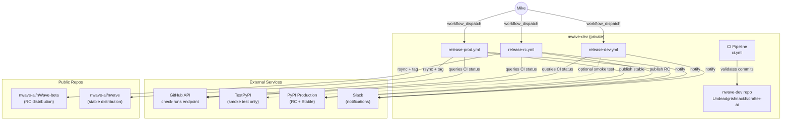
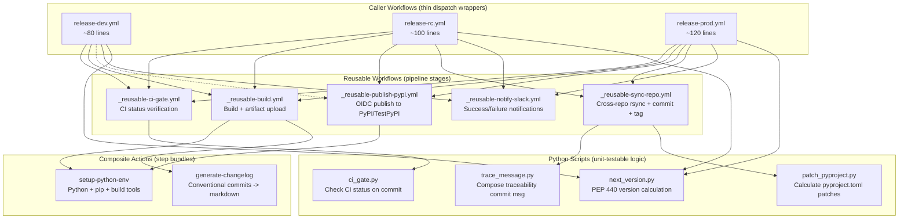
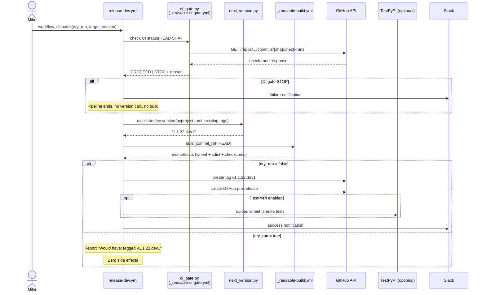
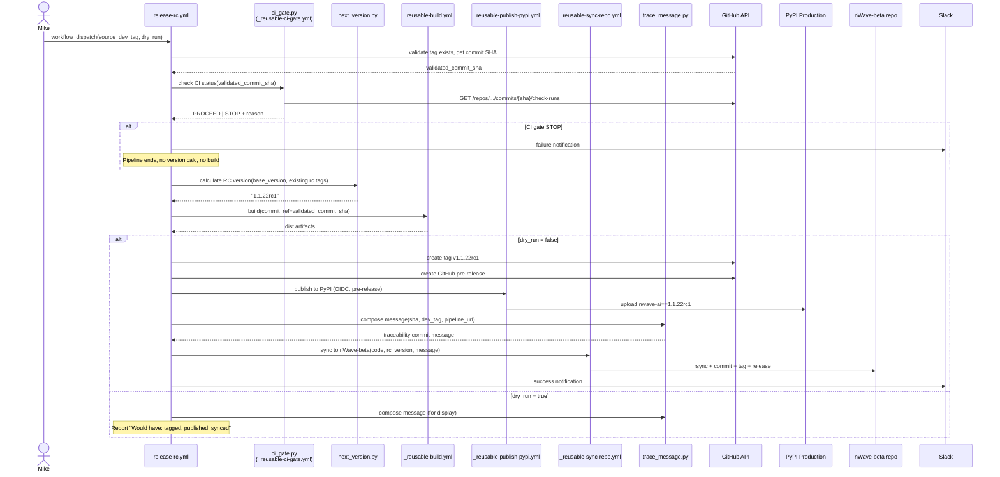
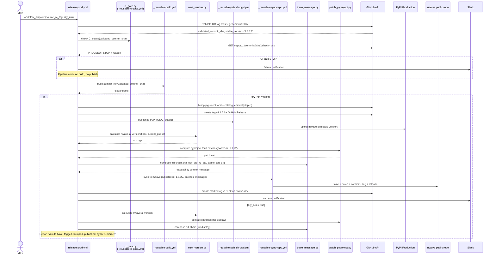

# Architecture: Release Train Revamp

**Feature**: release-train-revamp
**Architect**: Morgan (solution-architect)
**Date**: 2026-02-20
**Status**: DRAFT

---

## 1. System Context

The release train serves a private-to-public publishing pipeline for the nWave framework. A sole maintainer (Mike) develops on the private `nwave-dev` repo and publishes to two public targets: `nwave-ai/nWave-beta` (RC) and `nwave-ai/nwave` (stable), plus PyPI.



### Business Capabilities

| Capability | Description |
|------------|-------------|
| On-demand dev snapshot | Tag a commit set intentionally, not automatically |
| RC/Beta distribution | Publish pre-release to PyPI prod where testers opt in with `--pre` |
| Stable public release | Promote tested RC to stable across PyPI + public repo |
| Full traceability | Forward (dev -> public) and reverse (public -> dev) in one git command |
| Dry run debugging | Execute all logic with zero side effects for pipeline development |

---

## 2. Component Architecture

### 2.1 Component Diagram



### 2.2 Component Boundaries

| Component | Responsibility | Does NOT do |
|-----------|---------------|-------------|
| **Caller workflows** | Dispatch inputs, orchestrate reusable workflow calls, pass secrets explicitly | Business logic, version calculation, builds |
| **Reusable workflows** | Complete pipeline stages with inputs/outputs, own their runner | Access secrets without explicit passing |
| **Composite actions** | Bundle repeated step sequences within a job | Job orchestration, matrix strategies |
| **Python scripts** | All testable business logic: CI gate, version math, message composition, pyproject patching | GitHub API auth (receives token as arg), git operations |

### 2.3 Design Principle: Tests Shape Architecture

```
Python script  = unit testable with pytest + mocked GitHub API
Composite action = wraps Python script + sets up environment
Reusable workflow = integration test boundary (orchestrates composites)
Caller workflow = dry run test boundary (full pipeline, zero side effects)
```

Each Python script becomes the unit test boundary. The composite action wrapping it is intentionally thin: setup environment, call script, capture output. Reusable workflows orchestrate composite actions into complete stages.

---

## 3. File Structure

```
.github/
  workflows/
    ci.yml                          # EXISTING - no changes
    release-dev.yml                 # NEW - Stage 1 caller
    release-rc.yml                  # NEW - Stage 2 caller
    release-prod.yml                # NEW - Stage 3 caller
    _reusable-ci-gate.yml           # NEW - CI status gate (shared by all 3 stages)
    _reusable-build.yml             # NEW - Build dist + upload artifacts
    _reusable-publish-pypi.yml      # NEW - PyPI/TestPyPI OIDC publish
    _reusable-sync-repo.yml         # NEW - Cross-repo rsync + commit + tag + release
    _reusable-notify-slack.yml      # NEW - Slack notification (success/failure)
    release.yml                     # DELETE after migration

  actions/
    setup-python-env/
      action.yml                    # NEW - Python + pip + build tools setup
    generate-changelog/
      action.yml                    # NEW - Conventional commits -> release notes

scripts/
  release/                          # NEW directory
    ci_gate.py                      # NEW - CI status gate logic
    next_version.py                 # NEW - PEP 440 version calculation
    trace_message.py                # NEW - Traceability commit message composition
    patch_pyproject.py              # NEW - pyproject.toml patch calculation

  build_dist.py                     # EXISTING - reused by _reusable-build.yml
  framework/
    create_github_tarballs.py       # EXISTING - reused by _reusable-build.yml
  testpypi_validation.py            # EXISTING - reused by release-dev.yml (optional)

tests/
  release/                          # NEW directory
    test_ci_gate.py                 # NEW
    test_next_version.py            # NEW
    test_trace_message.py           # NEW
    test_patch_pyproject.py         # NEW
```

### 3.1 Existing System Reuse

| Existing Component | Reuse | Rationale |
|-------------------|-------|-----------|
| `scripts/build_dist.py` | Direct reuse | Already builds dist/ from nWave/ source; called by `_reusable-build.yml` |
| `scripts/framework/create_github_tarballs.py` | Direct reuse | Already creates release tarballs; called by `_reusable-build.yml` |
| `scripts/testpypi_validation.py` | Direct reuse | Already validates TestPyPI installation; called by `release-dev.yml` optionally |
| `scripts/framework/release_validation.py` | Reference only | Version conflict detection logic informs `next_version.py` design |
| CI pipeline (`ci.yml`) | Unchanged | CI gate queries its results via API; no modifications needed |

### 3.2 New Components Justification

| New Component | Why not reuse existing? |
|--------------|------------------------|
| `ci_gate.py` | No existing component queries GitHub Check Runs API; current pipeline re-runs tests |
| `next_version.py` | Current pipeline uses python-semantic-release which does not support PEP 440 `.devN`; need custom calculation |
| `trace_message.py` | Current commit messages lack traceability data; new capability |
| `patch_pyproject.py` | Current regex patching is inline in release.yml (lines 686-769); extracting to testable Python |

---

## 4. Data Flow Diagrams

### 4.1 Stage 1: Dev Release

CI gate runs first (fail-fast: 2-second API call stops the pipeline before any computation).



### 4.2 Stage 2: RC Release

CI gate runs after tag validation but before version calculation (fail-fast: no point computing rcN if CI is red).



### 4.3 Stage 3: Stable Release

CI gate runs after RC tag validation but before build (fail-fast: no point building if CI is red). The stable version is derived from the RC tag during validation, so no separate version calculation step precedes CI gate.



---

## 5. Contract Specifications

### 5.1 Python Scripts

#### ci_gate.py

| Aspect | Specification |
|--------|--------------|
| **Input** | `--repo OWNER/NAME`, `--commit-sha SHA`, `--token GITHUB_TOKEN` |
| **Output** | JSON to stdout: `{"status": "green|failed|pending|none", "message": "human-readable", "details": {...}}` |
| **Exit codes** | 0 = green (proceed), 1 = failed, 2 = pending, 3 = none, 4 = API error |
| **Behavior** | Single API call: `GET /repos/{owner}/{repo}/commits/{sha}/check-runs`. Filters out the calling workflow's own check-run (self-exclusion). Maps GitHub statuses to 4 outcomes. |
| **Dry run** | No dry_run needed; this is a read-only query |

#### next_version.py

| Aspect | Specification |
|--------|--------------|
| **Input** | `--stage dev|rc|stable`, `--current-version X.Y.Z`, `--existing-tags TAG1,TAG2,...` |
| **Input (stable/nwave-ai)** | `--public-version-floor X.Y.Z`, `--current-public-version X.Y.Z` |
| **Output** | JSON to stdout: `{"version": "1.1.22.dev1", "tag": "v1.1.22.dev1", "base_version": "1.1.22"}` |
| **Exit codes** | 0 = success, 1 = no version bump needed, 2 = invalid input |
| **Behavior (dev)** | Read current version from pyproject.toml. Determine next X.Y.Z via conventional commit analysis. Find highest existing `.devN` for that X.Y.Z. Return `.dev{N+1}`. |
| **Behavior (rc)** | Extract base version from source dev tag. Find highest existing `rcN` for that X.Y.Z. Return `rc{N+1}`. |
| **Behavior (stable)** | Extract base version from source RC tag. Return X.Y.Z (strip rc suffix). |
| **Behavior (nwave-ai)** | Compare floor vs current public: if floor > current, use floor; else patch-bump current. |

#### trace_message.py

| Aspect | Specification |
|--------|--------------|
| **Input** | `--stage rc|stable`, `--commit-sha SHA`, `--dev-tag TAG`, `--rc-tag TAG` (stable only), `--stable-tag TAG` (stable only), `--pipeline-url URL`, `--version VERSION` |
| **Output** | Commit message string to stdout |
| **Exit codes** | 0 = success |
| **Behavior (rc)** | Produces: `chore(release): v{version}\n\nSource: nwave-dev@{sha}\nDev tag: {dev_tag}\nPipeline: {url}` |
| **Behavior (stable)** | Produces: `chore(release): v{version}\n\nSource: nwave-dev@{sha}\nDev tag: {dev_tag}\nRC tag: {rc_tag}\nStable tag: {stable_tag}\nPipeline: {url}` |

#### patch_pyproject.py

| Aspect | Specification |
|--------|--------------|
| **Input** | `--source-pyproject PATH`, `--target-name nwave-ai`, `--target-version X.Y.Z`, `--dry-run` |
| **Output (dry-run)** | JSON diff to stdout showing before/after for each field |
| **Output (apply)** | Writes patched pyproject.toml to `--output PATH` |
| **Exit codes** | 0 = success, 1 = parse error |
| **Behavior** | Reads source pyproject.toml. Applies named transformations: rename package, set version, update authors, add CLI entry point, rewrite build targets, remove dev-only sections. Outputs patched file or diff. |

### 5.2 Composite Actions

#### setup-python-env

```yaml
# .github/actions/setup-python-env/action.yml
inputs:
  python-version:
    description: "Python version"
    default: "3.12"
  install-build-tools:
    description: "Install build/twine/hatch"
    default: "false"

# Steps: setup-python, pip upgrade, conditional build tools install
# No outputs needed
```

#### generate-changelog

```yaml
# .github/actions/generate-changelog/action.yml
inputs:
  version:
    description: "Release version for header"
    required: true
  output-path:
    description: "Path to write RELEASE_NOTES.md"
    default: "dist/releases/RELEASE_NOTES.md"
  scope:
    description: "Tag scope: 'dev' uses v* tags, 'public' uses v* tags (public version range)"
    default: "dev"

outputs:
  changelog-path:
    description: "Path to generated changelog file"

# Steps: checkout with depth 0, run Python changelog script, output path
```

### 5.3 Reusable Workflows

#### _reusable-ci-gate.yml

```yaml
on:
  workflow_call:
    inputs:
      commit-sha:
        type: string
        required: true
      repo:
        type: string
        required: true
    secrets:
      github-token:
        required: true
    outputs:
      status:
        description: "green | failed | pending | none"
      message:
        description: "Human-readable status message"

# Jobs: single job, runs ci_gate.py, parses JSON output into workflow outputs
```

#### _reusable-build.yml

```yaml
on:
  workflow_call:
    inputs:
      commit-ref:
        type: string
        required: true
      python-version:
        type: string
        default: "3.12"
    outputs:
      artifact-name:
        description: "Name of uploaded artifact"

# Jobs:
#   1. Checkout at commit-ref
#   2. setup-python-env composite action
#   3. pipenv install --dev --skip-lock
#   4. python scripts/build_dist.py
#   5. python scripts/framework/create_github_tarballs.py --version $VERSION
#   6. sha256sum checksums
#   7. actions/upload-artifact
```

#### _reusable-publish-pypi.yml

```yaml
on:
  workflow_call:
    inputs:
      artifact-name:
        type: string
        required: true
      target:
        type: string  # "pypi" | "testpypi"
        required: true
      environment:
        type: string  # "pypi" | "testpypi"
        required: true

permissions:
  id-token: write

# Jobs:
#   1. Download artifact
#   2. pypa/gh-action-pypi-publish (OIDC, no stored tokens)
#   3. Target URL varies by input
```

#### _reusable-sync-repo.yml

```yaml
on:
  workflow_call:
    inputs:
      target-repo:
        type: string
        required: true  # "nwave-ai/nWave-beta" or "nwave-ai/nwave"
      target-version:
        type: string
        required: true
      commit-message:
        type: string
        required: true
      source-commit-ref:
        type: string
        required: true
      create-github-release:
        type: boolean
        default: true
      prerelease:
        type: boolean
        default: false
      release-notes-path:
        type: string
        default: ""
      pyproject-patches:
        type: string  # JSON string of patches, or empty
        default: ""
    secrets:
      cross-repo-token:
        required: true
    outputs:
      target-version:
        description: "Version committed to target repo"
      target-tag:
        description: "Tag created on target repo"

# Jobs:
#   1. Checkout nwave-dev source at commit-ref
#   2. Checkout target repo
#   3. Save pre-sync target version (for nwave-ai auto-bump)
#   4. rsync with exclusions (same as current release.yml)
#   5. Apply pyproject patches if provided (via patch_pyproject.py)
#   6. Rewrite README links
#   7. Git commit with traceability message
#   8. Git tag + push
#   9. gh release create (if enabled)
```

#### _reusable-notify-slack.yml

```yaml
on:
  workflow_call:
    inputs:
      status:
        type: string  # "success" | "failure"
        required: true
      stage:
        type: string  # "dev" | "rc" | "stable"
        required: true
      version:
        type: string
        required: true
      details:
        type: string  # Additional context (install command, error message)
        default: ""
      run-url:
        type: string
        required: true
    secrets:
      slack-webhook-url:
        required: true

# Jobs: single job, compose Slack Block Kit payload, send via webhook
```

### 5.4 Caller Workflows

#### release-dev.yml (workflow_dispatch inputs)

```yaml
on:
  workflow_dispatch:
    inputs:
      target_version:
        description: "Target version (auto = next from conventional commits)"
        type: choice
        options:
          - auto
        default: auto
      dry_run:
        description: "Execute all logic, produce zero side effects"
        type: boolean
        default: false
      publish_testpypi:
        description: "Upload to TestPyPI (smoke test only, not distribution)"
        type: boolean
        default: false
```

#### release-rc.yml (workflow_dispatch inputs)

```yaml
on:
  workflow_dispatch:
    inputs:
      source_dev_tag:
        description: "Dev tag to promote (e.g., v1.1.22.dev3)"
        type: string
        required: true
      dry_run:
        description: "Execute all logic, produce zero side effects"
        type: boolean
        default: false
```

#### release-prod.yml (workflow_dispatch inputs)

```yaml
on:
  workflow_dispatch:
    inputs:
      source_rc_tag:
        description: "RC tag to promote (e.g., v1.1.22rc1)"
        type: string
        required: true
      dry_run:
        description: "Execute all logic, produce zero side effects"
        type: boolean
        default: false
```

---

## 6. Dry Run Propagation Design

Dry run is the primary debugging tool for pipeline issues. It must execute ALL logic and produce ZERO side effects.

### 6.1 Propagation Path

```
Caller workflow input: dry_run (boolean)
  |
  +--> Passed as input to every reusable workflow call
  |
  +--> Each reusable workflow checks dry_run before:
  |      - git tag / git push
  |      - gh release create
  |      - pypa/gh-action-pypi-publish
  |      - rsync to target repo (commit/push/tag)
  |      - Slack notification
  |
  +--> Python scripts: dry_run NOT needed (they compute; callers decide to act)
  |
  +--> Build step: ALWAYS executes (build is pure computation; artifacts are ephemeral)
```

### 6.2 Dry Run Output Contract

Each stage produces a structured summary to `$GITHUB_STEP_SUMMARY`:

```markdown
## Dry Run Report: Dev Release

| Step | Status | Result |
|------|--------|--------|
| CI status gate | CHECKED | green (all 4 check-runs passed) |
| Version calculation | COMPUTED | 1.1.22.dev1 |
| Build dist | BUILT | wheel + sdist (12.3 MB) |
| Create tag | SKIPPED (dry run) | Would create: v1.1.22.dev1 |
| GitHub pre-release | SKIPPED (dry run) | Would create pre-release |
| TestPyPI publish | SKIPPED (dry run) | Would upload to TestPyPI |
| Slack notification | SKIPPED (dry run) | Would notify #releases |

**Summary**: Would have tagged v1.1.22.dev1 on commit abc123d
```

For RC and Stable, the report additionally shows the traceability commit message and pyproject.toml patch diff.

### 6.3 What Dry Run Exercises

| Logic | Exercised in dry run? |
|-------|----------------------|
| CI status gate (GitHub API query) | Yes (read-only, runs first) |
| Version calculation (PEP 440 math) | Yes |
| Build dist (wheel + sdist) | Yes (artifacts built, not published) |
| Traceability message composition | Yes (message displayed) |
| pyproject.toml patch calculation | Yes (diff displayed) |
| Changelog generation | Yes (markdown rendered in summary) |
| Git tag creation | No (would-have message) |
| GitHub Release creation | No (would-have message) |
| PyPI upload | No (would-have message) |
| Cross-repo rsync + push | No (would-have message) |
| Slack notification | No (would-have message) |

---

## 7. Error Handling Strategy

### 7.1 Error Design Principles

1. **Errors must be human-readable.** No cryptic YAML errors, no stack traces unless unexpected.
2. **Errors must suggest recovery.** Every STOP includes what Mike should do next.
3. **Errors must surface early.** Fail at validation, not during publish.
4. **Errors in optional steps are warnings, not failures.** TestPyPI failure does not block dev tag.

### 7.2 Error Matrix

| Component | Error Condition | User Message | Recovery Action | Severity |
|-----------|----------------|--------------|-----------------|----------|
| `ci_gate.py` | CI failed | "CI failed on {sha}: {failed_check_names}" | Fix code, push, re-trigger | STOP |
| `ci_gate.py` | CI pending | "CI still running on {sha}, retry later" | Wait, re-trigger | STOP |
| `ci_gate.py` | No CI runs | "No CI run found for {sha}. Push to trigger CI first." | Push commit, re-trigger | STOP |
| `ci_gate.py` | API error | "GitHub API error: {status_code}. Check GH_TOKEN permissions." | Verify token scope | STOP |
| `next_version.py` | No bump commits | "No version-bump commits since {last_tag}" | Expected behavior | CLEAN EXIT |
| `next_version.py` | Invalid tag format | "Tag {tag} does not match PEP 440 format" | Use tag cleanup (US-RTR-007) | STOP |
| Caller workflow | Source tag not found | "Tag {tag} not found. Available: {list}" | Check tag name | STOP |
| `_reusable-build.yml` | Build failure | "Build failed: {error}" with build log link | Fix build, re-trigger | STOP |
| `_reusable-publish-pypi.yml` | OIDC failure | "Trusted Publisher not configured for this workflow" | Configure in PyPI settings | STOP |
| `_reusable-publish-pypi.yml` | Version exists | "v{version} already on PyPI" (RC: warning, Stable: STOP) | Increment counter or investigate | WARN/STOP |
| `_reusable-sync-repo.yml` | Push rejected | "Push to {repo} rejected. Check RELEASETRAIN token permissions." | Verify token scope | STOP |
| `_reusable-sync-repo.yml` | rsync failure | "Sync failed (exit {code}). Check source files." | Investigate source | STOP |
| TestPyPI | Upload failure | "TestPyPI upload failed (smoke test only, tag preserved)" | Ignore | WARN |

### 7.3 Error Reporting Flow

```
Error occurs in Python script
  --> Script outputs JSON with error details to stdout
  --> Script exits with non-zero code
  --> Composite action / workflow step captures exit code
  --> Step writes human-readable message to $GITHUB_STEP_SUMMARY
  --> If STOP: workflow fails, Slack notified
  --> If WARN: workflow continues, warning in summary
```

---

## 8. UX Design: workflow_dispatch Inputs

### 8.1 Design Principles

- Descriptions must be complete sentences that tell Mike what happens
- Defaults must be the most common choice (dry_run=false for real releases)
- Input names use snake_case (GitHub convention)
- Max 4 inputs per workflow (well under GitHub's 10-input limit)

### 8.2 Stage 1: Dev Release

| Input | Type | Default | Description |
|-------|------|---------|-------------|
| `target_version` | choice: [auto] | auto | Target version (auto = next from conventional commits) |
| `dry_run` | boolean | false | Execute all logic, produce zero side effects |
| `publish_testpypi` | boolean | false | Upload to TestPyPI (smoke test only, not distribution) |

### 8.3 Stage 2: RC Release

| Input | Type | Default | Description |
|-------|------|---------|-------------|
| `source_dev_tag` | string | (required) | Dev tag to promote (e.g., v1.1.22.dev3) |
| `dry_run` | boolean | false | Execute all logic, produce zero side effects |

### 8.4 Stage 3: Stable Release

| Input | Type | Default | Description |
|-------|------|---------|-------------|
| `source_rc_tag` | string | (required) | RC tag to promote (e.g., v1.1.22rc1) |
| `dry_run` | boolean | false | Execute all logic, produce zero side effects |

---

## 9. OIDC / Trusted Publisher Configuration

### 9.1 PyPI Project Settings

Configure Trusted Publishers for the `nwave-ai` package on PyPI:

| Publisher | Repository | Workflow | Environment |
|-----------|-----------|----------|-------------|
| TestPyPI | `Undeadgrishnackh/crafter-ai` | `release-dev.yml` | `testpypi` |
| PyPI (RC) | `Undeadgrishnackh/crafter-ai` | `release-rc.yml` | `pypi` |
| PyPI (Stable) | `Undeadgrishnackh/crafter-ai` | `release-prod.yml` | `pypi` |

### 9.2 GitHub Environment Setup

| Environment | Protection Rules | Used By |
|-------------|-----------------|---------|
| `testpypi` | None (smoke test, low risk) | `release-dev.yml` |
| `pypi` | Optional: required reviewers for stable | `release-rc.yml`, `release-prod.yml` |

### 9.3 Workflow Permissions

```yaml
# Only the publish job gets id-token: write
# Build jobs use contents: read only
permissions:
  id-token: write    # OIDC token for PyPI
  contents: write    # Create tags and releases
```

### 9.4 Migration Steps

1. Configure Trusted Publisher in PyPI project settings for each workflow filename
2. Configure Trusted Publisher in TestPyPI project settings for dev workflow
3. Create GitHub environments `pypi` and `testpypi`
4. Deploy new workflows using `pypa/gh-action-pypi-publish` with OIDC
5. Verify first publish succeeds with OIDC
6. Remove `PYPI_TOKEN` secret from GitHub

### 9.5 Fallback

If OIDC fails during initial migration, the `_reusable-publish-pypi.yml` supports an optional `api-token` secret input. This allows temporary fallback to API token auth without modifying workflow files. Remove after OIDC is verified.

---

## 10. Migration Plan from Current Monolith

### 10.1 Phases

```
Phase 0: Tag cleanup (US-RTR-007)
  - Audit existing tags
  - Remove non-standard tags
  - Document convention

Phase 1: Infrastructure (US-RTR-004, US-RTR-005)
  - Create scripts/release/ Python scripts with unit tests
  - Create composite actions
  - Create reusable workflows
  - Configure OIDC Trusted Publishers
  - Create GitHub environments
  - Existing release.yml untouched; new workflows coexist

Phase 2: Stage deployment (US-RTR-001, US-RTR-002, US-RTR-003, US-RTR-006)
  - Deploy release-dev.yml (test with dry run)
  - Deploy release-rc.yml (test with dry run)
  - Deploy release-prod.yml (test with dry run)
  - Execute one real dev -> RC -> stable cycle

Phase 3: Cutover
  - Remove release.yml (the monolith)
  - Remove PYPI_TOKEN secret
  - Update documentation
```

### 10.2 Coexistence Strategy

During migration, both the old `release.yml` and new stage-specific workflows exist simultaneously. They do not conflict because:

- Old: triggered by `workflow_dispatch` on "Release Pipeline" workflow name
- New: triggered by `workflow_dispatch` on separate workflow names ("Dev Release", "RC Release", "Stable Release")
- No tag push triggers on new workflows (old workflow handles `v*` tag pushes until removal)

### 10.3 Rollback

If any new workflow fails during the migration cycle:

1. Old `release.yml` remains functional and can be used immediately
2. New workflow can be fixed and re-tested with dry run
3. No data loss risk: failed workflows leave no side effects when dry_run=true

---

## 11. Testing Strategy

### 11.1 Test Pyramid

```
                 +------------------+
                 | Dry Run E2E      |  <-- 3 tests: one per stage
                 | (real GitHub API)|     Validates full pipeline with dry_run=true
                 +------------------+
                /                    \
         +------------------------+
         | Integration Tests      |  <-- Reusable workflow tests
         | (act or manual)        |     Validate YAML composition
         +------------------------+
        /                          \
  +-------------------------------------+
  | Unit Tests (pytest)                 |  <-- 4 scripts x ~10 tests each = ~40 tests
  | ci_gate, next_version,             |     Fast, mocked, no GitHub API
  | trace_message, patch_pyproject     |
  +-------------------------------------+
```

### 11.2 Unit Tests (Python scripts)

| Script | Test Coverage Areas |
|--------|-------------------|
| `test_ci_gate.py` | All green -> PROCEED; one failed -> STOP; pending -> STOP; no runs -> STOP; API error handling; self-exclusion of calling workflow |
| `test_next_version.py` | Dev: first dev (`.dev1`), sequential (`.dev3`), no bump commits; RC: first rc (`rc1`), sequential (`rc2`); Stable: strip rc suffix; nwave-ai: floor override, auto-bump |
| `test_trace_message.py` | RC message format; stable full chain format; special characters in tag names; URL encoding |
| `test_patch_pyproject.py` | Name swap; version set; author rewrite; build target rewrite; dev-section removal; idempotency; malformed input handling |

All tests use mocked HTTP responses (no real GitHub API calls). Tests run in CI as part of the existing test suite.

### 11.3 Dry Run as Integration Test

Each stage workflow is designed so that `dry_run=true` exercises all computational logic:

- CI gate queries the real GitHub API first (read-only, fail-fast)
- Version calculation runs (only if CI gate passes)
- Build runs (artifacts created, not published)
- Traceability messages composed
- pyproject.toml patches computed
- Changelog generated

The only things skipped are side effects: git push, PyPI upload, cross-repo sync, Slack.

This means every PR that modifies release scripts can be validated by triggering a dry run from the Actions UI.

### 11.4 Manual Integration Testing

Before cutover (Phase 3), execute one full real cycle:

1. Trigger `release-dev.yml` (real, not dry run) -> creates a real dev tag
2. Trigger `release-rc.yml` with that dev tag (real) -> creates real RC tag + PyPI publish
3. Trigger `release-prod.yml` with that RC tag (real) -> creates stable release

This validates the full chain including OIDC, cross-repo sync, and Slack.

---

## 12. Technology Stack

| Technology | Purpose | License | Rationale |
|------------|---------|---------|-----------|
| Python 3.12 | Release scripts | PSF | Already in use; team expertise |
| GitHub Actions | CI/CD platform | N/A (SaaS) | Already in use; workflow_dispatch, reusable workflows |
| `pypa/gh-action-pypi-publish` | OIDC PyPI publish | Apache 2.0 | Official PyPA action; handles OIDC automatically |
| `actions/checkout@v4` | Git checkout | MIT | Standard GitHub action |
| `actions/setup-python@v5` | Python setup | MIT | Standard GitHub action |
| `actions/upload-artifact@v4` | Artifact upload | MIT | Standard GitHub action |
| `actions/download-artifact@v4` | Artifact download | MIT | Standard GitHub action |
| `softprops/action-gh-release@v2` | GitHub Release creation | MIT | Widely used; handles asset upload |
| `slackapi/slack-github-action@v2` | Slack notification | MIT | Official Slack action |
| `httpx` | HTTP client for CI gate | BSD-3-Clause | Already a project dependency |
| `packaging` | PEP 440 version parsing | Apache 2.0 / BSD-2-Clause | Already a project dependency |
| `pytest` | Unit testing | MIT | Already in use |
| `rsync` | Cross-repo file sync | GPL-3.0 | Pre-installed on ubuntu-latest runners |

---

## 13. Secrets and Tokens

| Secret | Purpose | Scope | Current State | Target State |
|--------|---------|-------|---------------|-------------|
| `GH_TOKEN` | nwave-dev push + tag + version bump | Fine-grained PAT: contents:write on nwave-dev | Exists | No change |
| `RELEASETRAIN` | Cross-repo push to nWave-beta and nWave public | Classic PAT: repo scope | Exists | Migrate to fine-grained PAT (future: GitHub App) |
| `PYPI_TOKEN` | PyPI upload (current) | API token | Exists | DELETE after OIDC migration |
| `SLACK_WEBHOOK_URL` | Slack notifications | Incoming webhook URL | Exists | No change |

---

## 14. Quality Attributes

| Attribute (ISO 25010) | Strategy |
|----------------------|----------|
| **Reliability** | CI gate prevents releasing broken commits. Dry run validates logic before real execution. Immutable versions (never replace, always increment). |
| **Maintainability** | Modular structure: caller (40-120 lines) + reusable workflows (80-150 lines each). Python scripts unit-tested. No file exceeds 300 lines. |
| **Security** | OIDC tokens expire in 15 minutes. Secrets passed explicitly (not inherited). Build and publish are separate jobs. |
| **Traceability** | Full forward and reverse chain. Public commit messages contain source SHA, dev tag, RC tag, pipeline URL. Marker tags enable single-command reverse lookup. |
| **Usability** | workflow_dispatch inputs have clear descriptions and smart defaults. Dry run reports show exactly what would happen. Error messages include recovery steps. |
| **Testability** | Python scripts are fully unit-testable with mocked APIs. Dry run provides integration-level validation. Each component is independently testable. |

---

## 15. Concurrency and Idempotency

### 15.1 Concurrency Groups

```yaml
# Each stage gets its own concurrency group
# Two dev releases cannot run simultaneously
concurrency:
  group: release-dev
  cancel-in-progress: false  # Never cancel a release in progress
```

### 15.2 Idempotency Considerations

| Operation | Idempotent? | Mitigation |
|-----------|------------|------------|
| Git tag creation | No (tag exists = error) | Check before create; if exists, increment counter |
| GitHub Release creation | No (release exists = error) | Check before create; skip if exists |
| PyPI upload | No (version exists = 400) | RC: warn and continue. Stable: STOP (collision is serious) |
| Cross-repo push | Yes (git push is idempotent for same content) | No special handling needed |
| Slack notification | Yes (duplicate messages are harmless) | No special handling needed |

---

## 16. Roadmap Summary

| Phase | Stories | Est. | Description |
|-------|---------|------|-------------|
| 0 | US-RTR-007 | 1d | Tag audit + cleanup script, tag convention doc |
| 1 | US-RTR-004, US-RTR-005 | 4d | Python scripts + tests, composite actions, reusable workflows, OIDC setup |
| 2 | US-RTR-001, US-RTR-002, US-RTR-003, US-RTR-006 | 5d | Three caller workflows, traceability in commit messages, dry run validation |
| 3 | (cutover) | 1d | Remove release.yml, remove PYPI_TOKEN, update docs |

Total estimated: ~11 days.

---

## Appendix A: ADR Index

| ADR | Title | Status |
|-----|-------|--------|
| ADR-RTR-001 | [CI Status Gate over Re-Testing](#adr-rtr-001) | Accepted |
| ADR-RTR-002 | [PEP 440 Versioning Scheme](#adr-rtr-002) | Accepted |
| ADR-RTR-003 | [RC on Production PyPI](#adr-rtr-003) | Accepted |
| ADR-RTR-004 | [Custom Version Scripts over python-semantic-release](#adr-rtr-004) | Accepted |
| ADR-RTR-005 | [Trusted Publishers (OIDC) over API Tokens](#adr-rtr-005) | Accepted |
| ADR-RTR-006 | [rsync over git-subtree for Cross-Repo Sync](#adr-rtr-006) | Accepted |

---

### ADR-RTR-001: CI Status Gate over Re-Testing

**Status**: Accepted

**Context**: The release pipeline needs to verify that the commit being released passed CI. Additionally, dev releases are created on-demand via workflow_dispatch, not automatically on every green push. Research Section 2.1 validates that major projects (Kubernetes, Django, Terraform) do not auto-tag every commit; tag spam degrades the git namespace. Commit SHAs provide traceability between tagged releases; explicit workflow_dispatch creates tagged snapshots only when Mike intentionally distributes a dev build.

Two approaches for CI verification exist: re-run the full test suite inside the release pipeline, or query the GitHub API for existing CI results.

**Decision**: Query the GitHub Check Runs API (`GET /repos/{owner}/{repo}/commits/{sha}/check-runs`) to verify CI status. Do not re-run tests.

**Alternatives Considered**:
- **Re-run tests in release pipeline**: Guarantees test execution but adds 10+ minutes per release, duplicates the CI pipeline, and creates a discrepancy (release tests might pass even if trunk CI failed due to environmental differences).
- **Require manual attestation**: Mike manually confirms CI passed before triggering release. Error-prone and does not scale.

**Consequences**:
- Positive: Release pipeline runs in 2-3 minutes instead of 12+. Single source of truth for CI status (the CI pipeline itself). No test environment duplication.
- Negative: Depends on CI pipeline having run on the exact commit. If CI was skipped (e.g., `[skip ci]` tag), the gate will block. This is a feature, not a bug.

---

### ADR-RTR-002: PEP 440 Versioning Scheme

**Status**: Accepted

**Context**: The pipeline needs a versioning scheme for three stages (dev, RC, stable) that works in both git tags and PyPI.

**Decision**: Use PEP 440 everywhere. Dev: `X.Y.Z.devN`. RC: `X.Y.ZrcN`. Stable: `X.Y.Z`. Git tags use `v` prefix. Sequential integer for N counters.

**Alternatives Considered**:
- **SemVer with prerelease labels** (`1.2.3-dev.1`): Not PEP 440 compliant; pip and PyPI reject hyphens. Would require translation layer between git tags and PyPI.
- **CalVer** (`2026.02.1`): Valid but loses semantic meaning (major/minor/patch). Does not communicate promotion stages.

**Consequences**:
- Positive: Single versioning scheme across git and PyPI. Standard tooling (`packaging` library) handles parsing and comparison. PEP 440 ordering is well-defined.
- Negative: python-semantic-release does not support `.devN` natively; requires custom version scripts. Minor complexity in counter management.

---

### ADR-RTR-003: RC on Production PyPI

**Status**: Accepted

**Context**: RC releases need to be installable by beta testers via standard pip tooling. Two targets are available: TestPyPI and production PyPI.

**Decision**: Publish RC releases to production PyPI with PEP 440 pre-release markers. Use TestPyPI only for dev stage smoke-testing upload mechanics.

**Alternatives Considered**:
- **RC on TestPyPI**: Beta testers would need `--index-url https://test.pypi.org/simple/ --extra-index-url https://pypi.org/simple/` for dependency resolution. TestPyPI has reliability limitations and is explicitly "for testing upload mechanics" per PyPA documentation. No major Python project publishes RCs to TestPyPI.
- **RC on private artifact registry**: Would require additional infrastructure (e.g., Artifactory, CodeArtifact). Overkill for the current team size.

**Consequences**:
- Positive: Beta testers install with standard `pip install --pre nwave-ai`. No dependency resolution issues. Follows Django, pytest, pip, setuptools conventions.
- Negative: RC versions are publicly visible on PyPI (but pip ignores them by default). Requires OIDC setup for production PyPI on the RC workflow.

---

### ADR-RTR-004: Custom Version Scripts over python-semantic-release

**Status**: Accepted

**Context**: The pipeline needs PEP 440 `.devN` and `rcN` version calculation. python-semantic-release (PSR) handles stable version bumps from conventional commits but does not support PEP 440 `.devN` natively.

**Decision**: Use a custom `next_version.py` script for all version calculations. Use PSR concepts (conventional commit analysis) but implement PEP 440 formatting directly.

**Alternatives Considered**:
- **Use PSR with post-processing**: PSR calculates next X.Y.Z, then a wrapper appends `.devN` or `rcN`. Adds PSR as a dependency, introduces version string translation, and PSR's `version --print` behavior has changed across major versions.
- **Use `bumpversion` / `bump2version`**: Does not analyze conventional commits. Would need a separate commit analysis step plus bumpversion for file updates. Two tools for one job.

**Consequences**:
- Positive: Full control over PEP 440 formatting. No dependency on PSR's version string handling. Single script, fully unit-testable. Uses `packaging` library (already a dependency) for version parsing.
- Negative: Must implement conventional commit analysis for X.Y.Z bump detection. More initial development than configuring PSR. Risk of reimplementation bugs.

---

### ADR-RTR-005: Trusted Publishers (OIDC) over API Tokens

**Status**: Accepted

**Context**: The pipeline uploads packages to PyPI. Currently uses a stored `PYPI_TOKEN` secret (indefinite lifetime, account-scoped).

**Decision**: Migrate to Trusted Publishers (OIDC) using `pypa/gh-action-pypi-publish`. Configure per-workflow publishers in PyPI project settings. Remove `PYPI_TOKEN` after migration.

**Alternatives Considered**:
- **Keep API tokens with rotation policy**: Reduces risk window but still requires manual rotation. PyPI's own documentation calls this approach "obsolete" for CI/CD.
- **Use GitHub App tokens for PyPI**: Not supported; PyPI only supports OIDC via GitHub Actions JWT or manual API tokens.

**Consequences**:
- Positive: Tokens expire in 15 minutes. No stored secrets for PyPI. Per-workflow scoping. Full audit trail.
- Negative: One-time setup required in PyPI project settings. Each workflow filename must match the OIDC claim. If workflow filenames change, Trusted Publisher config must be updated.

---

### ADR-RTR-006: rsync over git-subtree for Cross-Repo Sync

**Status**: Accepted

**Context**: The pipeline syncs source code from the private nwave-dev repo to public repos (nWave-beta, nWave). The sync must exclude private files and rewrite certain files (pyproject.toml).

**Decision**: Continue using rsync with exclusion lists for cross-repo sync. Enhance with traceability commit messages and automated pyproject.toml patching via `patch_pyproject.py`.

**Alternatives Considered**:
- **git subtree**: Preserves full commit history but makes exclusions difficult. Merge conflicts between repos are complex. Overkill for a one-way sync.
- **GitHub Actions file sync (PR-based)**: Creates PRs on target repo for audit trail. Adds review overhead for automated releases. Better suited for config sync, not full-tree sync.

**Consequences**:
- Positive: Fine-grained exclusion control. Proven approach (current release.yml uses this). Simple mental model: "copy files, exclude private stuff, patch identity."
- Negative: Git history is lost in target repo (each sync is a new commit). The exclusion list must be maintained as files are added/removed. pyproject.toml patching is fragile (mitigated by extracting to testable Python script).
