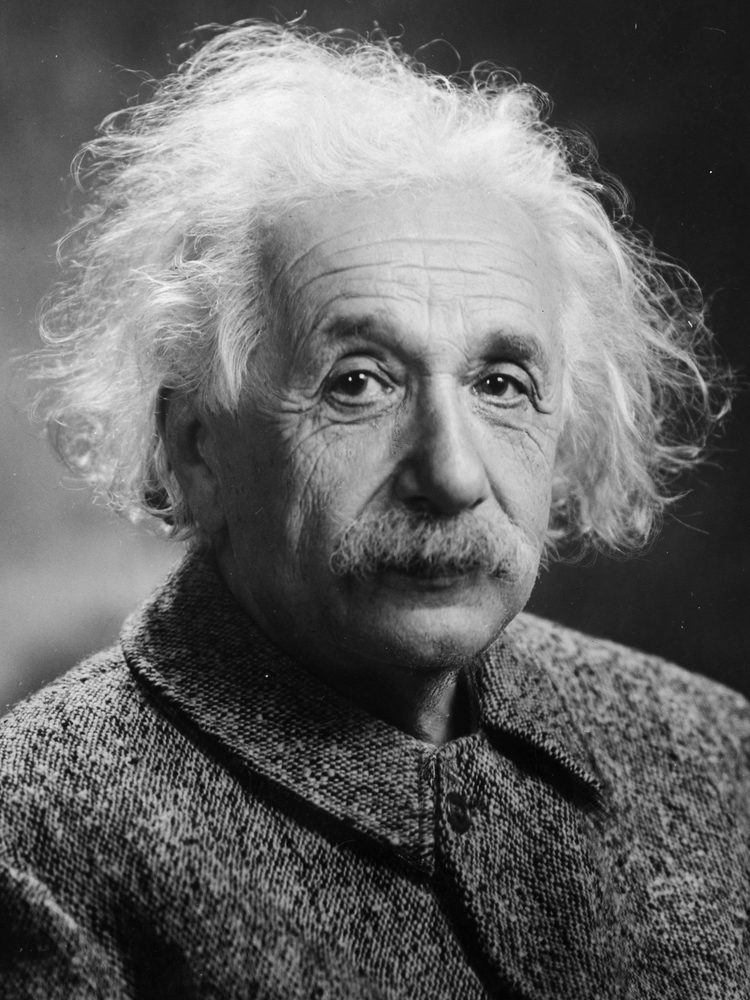

# Tutorial: Your First Delivery

**Time**: ~13 minutes (5 steps)
**Platform**: macOS, Linux, or Windows
**Prerequisites**: Python 3.10+, Claude Code with nWave installed
**Dependencies**: None beyond pytest. Pure Python.
**Important**: Create your project in a permanent directory (not `/tmp`). Later tutorials build on this project's artifacts.

---

## Setup

Run from a directory where you want the tutorial project created (e.g. `~/projects`):

```bash
curl -fsSL {{NWAVE_RAW_URL}}/docs/guides/tutorial-first-delivery/setup.py | python3
```

Prefer to read first? See [manual-setup.md](./manual-setup.md).

## After setup you should have

- A `tutorial-ascii-art/` directory containing `src/ascii_art/__init__.py`, `tests/test_ascii_art.py`, `tests/fixtures/diagonal.ppm`, and `pyproject.toml`
- A `.venv/` virtual environment with `pytest` installed
- Three failing acceptance tests in `tests/test_ascii_art.py` (run `pytest tests/ -v` to confirm)

---

## What You'll Build

An image-to-ASCII-art converter. Give it any photo, get ASCII art in your terminal.

**Before** — Einstein's 1947 portrait ([public domain](https://www.loc.gov/pictures/item/2004671908/), photo by Oren Jack Turner):



**After** — the same image converted to ASCII with `image_to_ascii('einstein.ppm', width=72)`:

```
::::::::::........::......::.:::::::::.........................
::::::::::::......:--:-==+=--::::::::..........................
:::::::::::::..::::-+++*++*##**==--===:.:::....................
::::::::-:::::::::+*++**##%%########***=-:...::::..............
::::::----::::--=++*##%#########%%%#######++==------............
::::::---:==-++++*#%%%%%%%%%%%%%%%%%%%%%##########*+=..........
::--------+++***####%%%%%%####%%#%%#%%%%####%%%%%%#*++:::......
--------===+++***#%%##%%%###########%%#####%%##%%#####-:::....
-------====+##*#######################################+--:....
---------+==+**##########*************############**#####*.:..
-------=+=+*######*******==++++*****###############***#**##-...
======+==********+==+***+=-==+++****##############****###**#+-:
========+++++*******#**++-:--====++**#############*****###***=-:
========+++****###++**++=--:--==+++**##############***********+-
=====+++++++*****+===+*+=--::---====+*#############***###*****+-
====+*+***##*+*++*===+*++--:::--:.:::-=**####**==+++**##*******+
++++++++*#****+===---+*+=--:::--=::::-.:-=***=-....-=**##***+*+-
++++**********+++----=*+---::::-:..:-:-:::*#+=::-=+=++****+#*++=
+++++++**##****-.:::--=-:::-===-::--++=-::+##***+=+=-*#*+++*#++:
++=++==++*+***+-.:.........-========++=-::-*###+=+****+++++***=-
====+==+=+++**+=-...:......:-=++++++*+--::-+#*##******=++=++*+==
===+++==*+**+*==-...........-==+++++++:  .-+*#**#*****=====++*+-
=====++++*++++=:--.::.......:--==+++=..:...-+**=*#****==-=+++=+:
==========+=+*+=-:.........:-:.:=++=---:.. ..+***=***=:-+=++=+*:
=====++++++++++=+=:.........-:.:---=------=====****+++::--++-:-
===+++++++++++++++:  ...........::--::-:.-:--:-=++**+:.:........
+++++++++********=..  ..............      ....-::=++-.........
+++++++++++++**--:         .... .....:::---===++=--.........
+++++++++===**-...                ..::-==+++***+-++**+:.......
+++======-=++-:...                  ...::--:-=---=+++=*++++=-.
+==---:-+++=-:=:                          ....:-----=+=--===+++
=--:-+**+**+-. .::.. .                   .:-: .:-=----==-=+--==
```

You define what "done" looks like. nWave writes the code to get there.

---

## Step 1 of 5: Inspect the starter project (~2 minutes)

After running setup, `cd tutorial-ascii-art` and activate the virtualenv:

```bash
cd tutorial-ascii-art
source .venv/bin/activate
```

> **Windows users**: Replace `source .venv/bin/activate` with `.venv\Scripts\activate`.

What's inside:

```
tutorial-ascii-art/
  src/ascii_art/__init__.py    # Empty — this is what nWave will implement
  tests/test_ascii_art.py      # 3 acceptance tests (already written for you)
  tests/fixtures/diagonal.ppm  # 4x4 test image (white diagonal on black)
  pyproject.toml
```

Run the tests to confirm they fail:

```bash
pytest tests/ -v
```

```
FAILED test_ascii_art.py::test_converts_image_to_ascii_with_correct_width
FAILED test_ascii_art.py::test_output_uses_only_density_characters
FAILED test_ascii_art.py::test_bright_pixels_produce_dense_characters

3 failed
```

**That's your first result** — red tests that define the feature. Three behaviors, fully specified:

1. **Correct width**: Convert with `width=20`, every line is exactly 20 characters
2. **Valid characters**: Output uses only the density ramp `" .:-=+*#%@"`
3. **Brightness mapping**: White pixels → dense chars (`@`, `#`), dark → sparse (` `, `.`)

You don't need to tell nWave *how* to implement it — just *what* the result must look like.

*Next: you'll hand these red tests to nWave and watch it turn them green.*

---

## Step 2 of 5: Let nWave Deliver (~8 minutes)

> **AI output varies between runs.** Your code will differ from the examples
> below. That is normal. We define success by what the code *does* (tests pass),
> not what the agent *says*.

Open Claude Code and start the delivery:

```bash
claude
```

Then type this Claude Code command (not a terminal command):

```
/nw-deliver "Image-to-ASCII art converter using PPM format"
```

### Reading the output

The delivery runs through several phases. Here's what you'll see and what it means:

**Phase 1 — Roadmap** (~30 seconds)
```
● nw-solution-architect(Fill roadmap skeleton)
  ⎿  Done (3 tool uses · 9.8k tokens · 25s)
```
The `@solution-architect` reads your tests and creates a step-by-step plan. You'll see it create `docs/feature/*/roadmap.json`, then a reviewer validates it.

**Phase 2 — TDD Execution** (~5 minutes)
```
● nw-software-crafter(Execute step 01-01)
  ⎿  Done (10 tool uses · 17.0k tokens · 1m 14s)
```
Each step follows the TDD cycle: write a failing test (RED), implement minimal code (GREEN), commit. You'll see this repeat 2-3 times — once per function the architect planned.

**Phase 3 — Refactoring** (~1 minute)
Systematic cleanup: naming, duplication, structure. The crafter applies progressive refactoring levels (L1-L4) across all modified files.

**Phase 4 — Review** (~1 minute)
```
● nw-software-crafter-reviewer(Adversarial review)
  ⎿  Done (8 tool uses · 13.6k tokens · 42s)
```
An independent reviewer checks code quality and tests for common anti-patterns. If issues are found, they get fixed automatically.

**Phase 5 — Mutation Testing** (~2 minutes)
Small mutations are introduced in the code (e.g., changing `>` to `>=`). If your tests catch them, good. The gate requires 80%+ kill rate.

**Phase 6 — Finalize** (~30 seconds)
Archives the feature and creates an evolution document.

### Messages you can safely ignore

You'll see lines like these throughout — they're normal internal coordination:

```
⎿  PreToolUse:Task hook error     ← DES validation checkpoint (normal)
⎿  DES_MARKERS_MISSING: ...       ← Occasionally appears on first try, auto-retries
```

These are the Deterministic Execution System (DES) ensuring every step follows the TDD protocol. Think of them as quality gates, not errors.

### Troubleshooting

| Symptom | Fix |
|---------|-----|
| No output for 2+ minutes | Check Claude Code status bar — a pulsing indicator means the agent is still working |
| Tests still failing after delivery | Run `/nw-deliver` again — it resumes from where it left off |
| Agent errors out mid-delivery | Type `/nw-deliver` again — it picks up the existing roadmap |
| Want to start completely fresh | `git stash && git checkout main` then re-clone |

*Next: you'll run the tests and try the converter yourself.*

---

## Step 3 of 5: See the Result (~1 minute)

When delivery completes, you'll see a summary table. Run your tests:

```bash
pytest tests/ -v
```

Expected:

```
test_ascii_art.py::test_converts_image_to_ascii_with_correct_width PASSED
test_ascii_art.py::test_output_uses_only_density_characters PASSED
test_ascii_art.py::test_bright_pixels_produce_dense_characters PASSED

3 passed
```

All green. Now try the converter on the test fixture:

```bash
PYTHONPATH=src python3 -c "
from ascii_art import image_to_ascii
print(image_to_ascii('tests/fixtures/diagonal.ppm', width=40))
"
```

You should see a small ASCII diagonal — bright characters along the diagonal, dark everywhere else.

> **If you see `ModuleNotFoundError`**: Make sure your venv is activated and you included `PYTHONPATH=src`.

*Next: you'll try a more interesting image and explore the output.*

---

## Step 4 of 5: Explore (~2 minutes)

Create a gradient image and convert it:

```bash
PYTHONPATH=src python3 -c "
width, height = 32, 16
with open('gradient.ppm', 'w') as f:
    f.write(f'P3\n{width} {height}\n255\n')
    for y in range(height):
        row = []
        for x in range(width):
            v = int(255 * x / (width - 1))
            row.append(f'{v} {v} {v}')
        f.write('  '.join(row) + '\n')

from ascii_art import image_to_ascii
print(image_to_ascii('gradient.ppm', width=60))
"
```

You should see a smooth ramp from spaces on the left (dark) to `@` signs on the right (bright):

```
 .:-=+*#%@  .:-=+*#%@  .:-=+*#%@  .:-=+*#%@  .:-=+*#%@  .:-=
```

Look at the git log to see how nWave built the code:

```bash
git log --oneline
```

```
abc1234 green(ascii-art): implement brightness mapping
def5678 green(ascii-art): implement character validation
ghi9012 green(ascii-art): implement width conversion
```

Every commit maps to a TDD step. You can trace exactly how the code was built.

*Next: a recap of what nWave did for you.*

---

## Step 5 of 5: What Just Happened (~1 minute)

You started with 3 failing tests and an empty `__init__.py`. nWave delivered:

- A **roadmap** breaking the feature into implementation steps
- **Production code** built through strict TDD (every test was red before green)
- **Refactored code** checked against progressive quality levels
- **Peer review** by an independent reviewer agent
- **Mutation testing** validating your test suite catches real bugs
- **Atomic commits** at every green step — traceable via `git log --oneline`

### What You Didn't Have to Do

- Write the implementation
- Figure out how to parse PPM files
- Map pixel brightness to ASCII characters
- Write unit tests (nWave wrote them from your acceptance tests)
- Review your own code (the reviewer agent did it)
- Validate your test suite (mutation testing did it)

You defined "done". nWave delivered it with engineering discipline you'd expect from a senior team.

---

## Next Steps

This tutorial used `/nw-deliver` directly — you wrote the acceptance tests by hand. The full nWave workflow has specialized agents for every stage:

| Wave | What it does | Guide |
|------|-------------|-------|
| DISCUSS | Requirements gathering with AI product owner | [Tutorial: DISCUSS wave](../tutorial-discuss/) |
| DESIGN | Architecture decisions with AI solution architect | [Tutorial: DESIGN wave](../tutorial-design/) |
| DEVOPS | Infrastructure readiness with AI platform architect | [Tutorial: DEVOPS wave](../tutorial-devops/) |
| DISTILL | Auto-generate acceptance tests from requirements | [Tutorial: DISTILL wave](../tutorial-distill/) |
| DELIVER | TDD implementation (what you just did) | This tutorial |

Each guide is ~5 minutes and builds on the previous one. By the end, you'll know the complete workflow.

---

**Last Updated**: 2026-02-17
